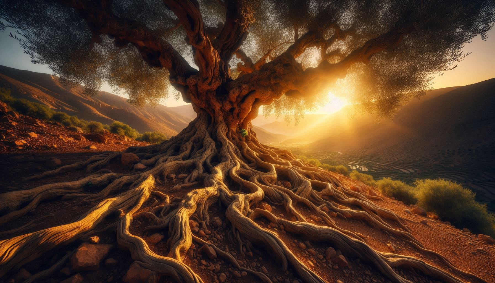
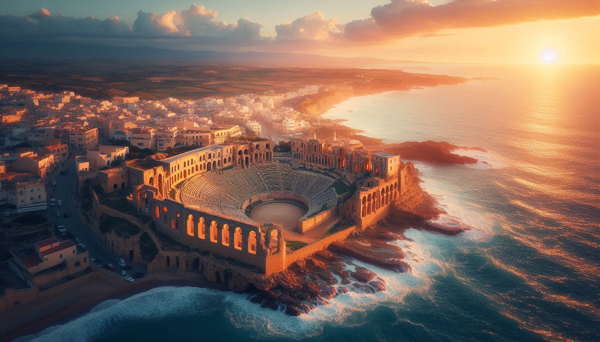
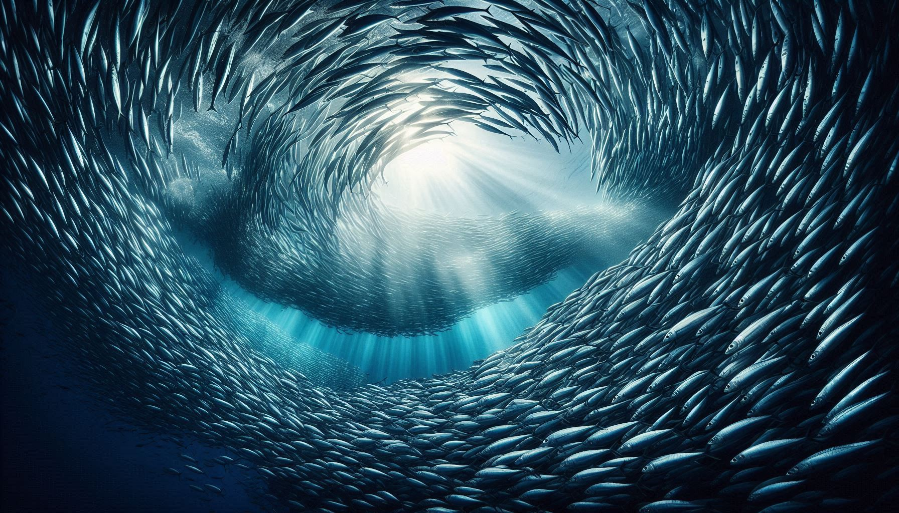
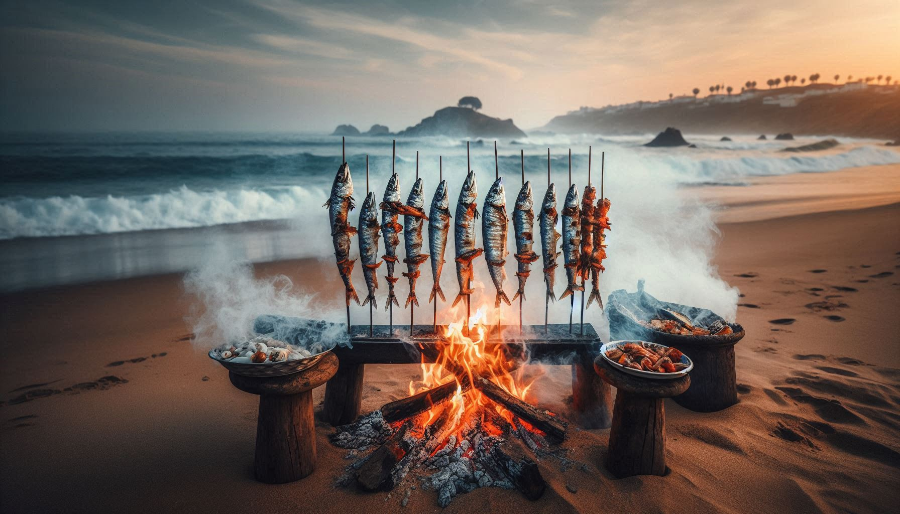
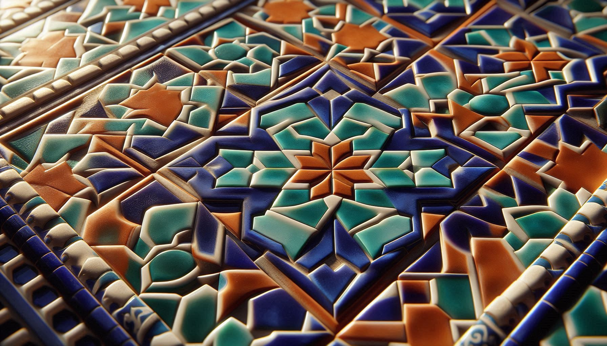

## I. The Scent of Dry Earth at 3 AM

*The Mediterranean doesn't lie. That night in Málaga, watching pixelated olive harvest videos from Ksar El-Kébir, I tasted the bitter truth: my digital nomad dream had become a gilded cage. The world was at my fingertips, yet I ached for the specific scent of dry earth after rain in my hometown. Here's how [Mediterranean truths](/about/philosophy/salah-philosophy/) saved my soul from rootless freedom...*

They promised liberation through movement. Passport stamps as trophies, Wi-Fi passwords as keys to kingdoms. But true freedom arrived unexpectedly during lockdown:

> "My father's radio waves became companions in the silence, voices whispering from the cosmos. In that open-source connection, I discovered resonance purer than bandwidth - inner energy synchronizing with the world's vibrations."  
> *(Chapter 14: Roots in the Wind)*

This is the nomad's paradox: **the more horizons we chase, the more essential our roots become**. Research shows 42% of long-term nomads suffer "chronic rootlessness" ([FlexJobs 2024](https://www.flexjobs.com/)). Why? Unbounded movement without anchoring creates spiritual drift.

Three Mediterranean truths became my anchors:

## II. Truth 1: Olive Trees Teach Depth-Freedom

**The Radical Realization:**  
*Watching ancient Jbala olive trees weather storms that shattered modern greenhouses, I understood: roots aren't anchors - they're the keel stabilizing your voyage through chaos.*

These gnarled guardians hold their secret in interwoven root systems reaching cultural bedrock. My entrepreneurial journey mirrored this when banks rejected my dreams:

> "The savory mineral-rich clay of the Eastern Atlas - used by my grandmother for cleansing rituals - became my lifeline. Not products, but narrative vessels carrying ancestral wisdom."  
> *(Chapter 4: Digital Awakening)*

This anchoring manifests at **Lixus**, where Rome met Morocco:

**Your Ritual:**  
*Place hands on earth and ask:*  
*"What dormant wisdom in my roots solves modern problems?"*  
*(My answer: Transforming Amazigh soup rituals into AI prompt frameworks)*

## III. Truth 2: Sardines Navigate Nutrient Currents

**The Mediterranean Secret:**  
*Watching Larache fishermen prepare '[espetos](/malaga-codex/local-rituals/espetos-epiphanies/)' identical to Malaga's, I grasped why sardines migrate for millennia without destruction: they follow currents nourishing both shores.*

This is **Sardine Navigation** - the antidote to nomadic extraction. When I launched cross-Mediterranean collaborations:

> "Each sample sent to partners was a bridge between roots and modern markets. [Ritual Hammam](/cultural-bridges/collaborations/ghost-of-ritual-hammam/) emerged from Roman baths meeting Moroccan traditions in my imagination."  
> *(Chapter 5: Nomad Seeds)*

**On Larache Beach:**  

**The Algorithmic Principle:**  
*Data, like fish, should enrich ecosystems, not deplete them.*

**Your Navigation Kit:**
1. **What unique thread from my roots can I weave here?**  
2. **What local wisdom can challenge my core?**  
3. **How will this place reshape my roots?**  

## IV. Truth 3: Zellige is Your Fluid-Coherent Self

**The Childhood Revelation:**  
*Growing up surrounded by zellige in Ksar El-Kébir, I believed these patterns were uniquely ours. Discovering identical geometries in Andalusia, I understood: identity is portable artistry.*

Moorish artisans didn't invent new tiles - they recombined core elements into context-specific beauty. This became my **Zellige Identity**:

> "Like zellige, we carry essential patterns. The deeper magic? Its logic mirrors [how I build digital value](/digital-compass/nomad-toolkit/zellige-blueprint/): HTML as geometric framework, content as colored fragments, SEO as binding mortar."  
> *(Chapter 12: The Ancestors' Road)*

This fluid coherence creates authentic presence - the kind that [builds tribes](/about/testimonials/the-human-constellation/), not just traffic.

## V. Your Anchored Freedom Starter Kit

Transform Mediterranean wisdom into daily practice:

**Morning Ritual (5 min):**  
*Press palms to floor - "What ancestral strength guides me today?"*  

**Noon Practice (2 min):**  
*Before sending email - "Is this nourishing or extracting?"*  

**Evening Reflection (3 min):**  
*Review day - "Which authentic 'tiles' did I express?"*  

**First Steps:**  
- Cook [one family recipe](/cultural-bridges/food/saffron-argan-algorithms/) this week  
- Apply the 3-Question Navigator to your next meeting  
- Express one core value tangibly tomorrow  

**Join Our Caravan:**  
Share your #AnchoredNomadJourney in comments. Your story becomes part of our mosaic.

**Next Compass Point:**  
In Part 2, we build your **Digital Hammam** - crafting focus sanctuaries in our hyperconnected world. Until then, remember:

> "Roots aren't where you're stuck. They're where you gather strength before leaping."

— Salah Nomad  
*Where roots and Wi-Fi dance*