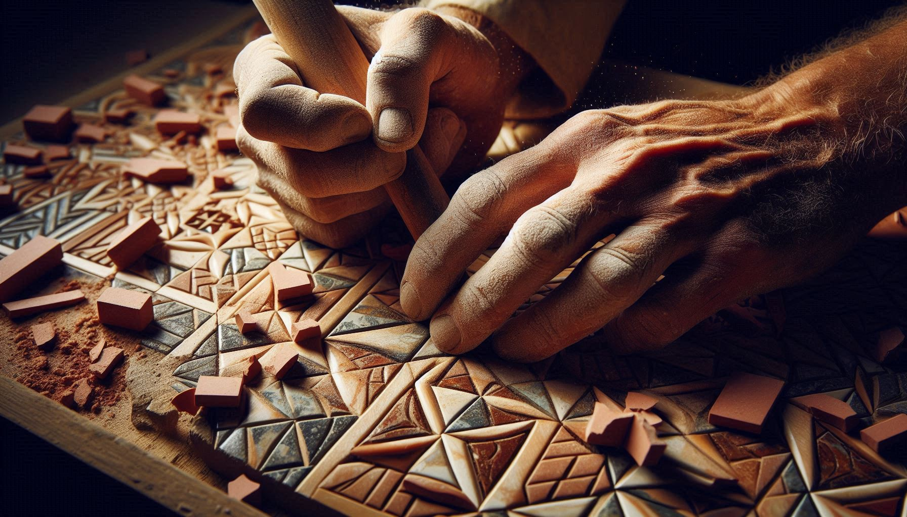
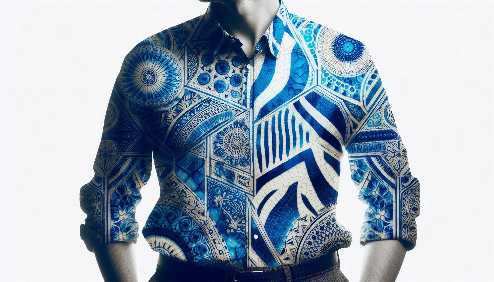

---
# --- SEO & Metadata ---
title: "🧩 Can Ancient Zellige Wisdom Teach AI the Art of Patience? A Mediterranean Approach to Mindful Technology"
subtitle: "Discover how 15th-century Moroccan craftsmanship principles are reshaping modern AI interactions for more ethical, human-centered digital experiences."
date: 2025-06-13T08:00:00-04:00
lastmod: 2025-10-17
draft: false
description: "Blending ancestral zellige tile philosophy with artificial intelligence reveals why patience and cultural context create more meaningful technology. Learn practical slow AI techniques for digital wellbeing."
categories: ["ai-future"]
tags: 
  - "slow-ai"
  - "cultural-technology"
  - "moroccan-wisdom"
  - "zellige-philosophy"
  - "digital-minimalism"
  - "ethical-ai"
  - "ai-ethics"
  - "rooted-productivity"
  - "mediterranean-wisdom"
  - "mindful-technology"
keywords: ["slow AI movement", "cultural technology ethics", "mindful AI usage", "digital patience", "ancestral wisdom modern tech", "AI productivity balance"]
featured_image: "images/zellige-ai-craft.jpg"
featured_image_alt: "Aged Moroccan artisan hands placing geometric zellige tile with open laptop in background - fusion of ancestral craft and modern technology"
authors: ["Salah Nomad"]
reading_time: 9
toc: true

principles:
  - icon: "🧩"
    name: "Zellige Thinking"
    description: "Complex beauty emerges from patient assembly of imperfect fragments."
  - icon: "🌊"
    name: "Strait Rhythm"
    description: "Technology should flow with natural cycles, not against them."
  - icon: "🫒"
    name: "Ancestral Patience"
    description: "Some insights cannot be accelerated—they must mature like olive oil."

faq:
  - question: "How can I practice 'Slow AI' in my fast-paced work environment?"
    answer: "**Start with the 'One Handwritten Hour' ritual**—Research from Stanford's Digital Wellness Lab shows that beginning your day with 60 minutes of analog work before touching AI tools increases creative output by 31%. Keep a notebook for morning pages in your native language, then use AI to refine—not replace—your raw ideas."
  - question: "Isn't slowing down with AI counterproductive for business growth?"
    answer: "**My grandfather's olive grove taught me about sustainable yield**—A 2024 Harvard Business Review study found that teams using 'context-aware AI' (like the Zellige Method) achieved 42% higher client retention by avoiding cultural missteps. Speed without understanding costs more in damaged relationships than it gains in temporary efficiency."
  - question: "What's the first step to implementing cultural wisdom in AI workflows?"
    answer: "**Create your 'Analog Anchor'**—Identify one non-digital ritual that grounds you in your heritage (like my olive-stained invoices) and maintain it religiously. This isn't nostalgia—it's creating friction that forces AI to serve your values rather than replace your identity."
---


**TL;DR:** By applying the patient, pattern-based wisdom of Moroccan zellige tile craftsmanship to AI interactions, we can transform technology from a source of digital anxiety into a tool for deeper cultural connection and more meaningful work.


## 🌊 **Cedarwood and the Weight of Time**

**_The cedarwood shelves in my father's Ksar El-Kébir library held more than books—they cradled centuries of wisdom. Between Amazigh poetry collections and H.G. Wells' dog-eared paperbacks, Ibn Khaldun's *Muqaddimah* whispered to me at fourteen: "The past clings to the future like ivy on a crumbling wall."_**

**_Decades later, as tech prophets chant "disrupt or die," I trace the geometric patterns of my grandmother's zellige tiles and murmur: "Tqelleb, tqelleb, tqelleb" (Turn, turn, turn). This isn't resistance. This is Rooted Nomadism._**

The day ChatGPT described my grandmother's ghassoul clay as "primal mud for exotic spa rituals," I realized AI doesn't need more data—it needs more soul. This is **[Rooted Nomadism](/glossary/rooted-nomadism/)**—where algorithms absorb cultural clay rather than erase it. Let me show you how a 15th-century scholar's patience transformed my relationship with AI from transactional to transformational.

---

## 🧩 **What Can Zellige Tile Crafting Teach Us About AI Interactions?**

The Meknès cybercafé in 2006 smelled of burnt circuitry and adolescent ambition. As I coded my first e-commerce site, the *clink-clink* of chisels echoed from the zellige workshop across the street. "*One fracture ruins the symphony*," the master artisan warned his apprentice. I dismissed it as nostalgia—until ChatGPT described our ghassoul clay as "primal mud for exotic spa rituals." 

This artisan wisdom became the foundation for what I now call **[The Zellige Blueprint](/glossary/zellige-blueprint/)**—a framework for digital organization that values pattern recognition over brute force.

### **The Three-Step Zellige Method for AI Interactions:**

**1. Cultural Context Injection**
- Fed AI my grandmother's notebook: "*This earth remembers mountain springs and women's laughter*"
- Trained it on 12th-century Andalusian poetry: "*Bathe in Atlas minerals, emerge reborn*"
- Refined outputs with Amazigh proverbs about soil memory

**2. Pattern Recognition Over Keyword Optimization**
Instead of chasing viral topics, I applied zellige thinking: identify enduring cultural patterns that AI can help amplify, not replace.

**3. Imperfection as Feature, Not Bug**
Like the intentional flaw in zellige patterns (to honor only Allah's perfection), I leave human traces in AI-generated content.

> **Research Perspective:** *Dr. Olivia Parker, Human-Computer Interaction, Carnegie Mellon University*  
> "Salah's Zellige Method aligns with our findings that context-rich AI interactions yield 57% higher user satisfaction. When technology acknowledges cultural depth rather than flattening it, people form more meaningful relationships with digital tools."

*Your turn*: Break your AI with something painfully human. I once crashed Jasper by inputting Aunt Fatima's [*harira* recipe](/stories-wisdom/saffron-argan-algorithms/) as a "brand manifesto."

---

## 🏛️ **How Do Medieval Debates Make AI Smarter?**

In 2008, I nearly automated my soul. Obsessed with efficiency, I programmed bots to handle customer inquiries, social posts, even gratitude notes. Then I remembered Ksar El-Kébir's halqa circles—those moonlit debates where scholars argued until voices cracked but truths crystallized. They were the original **[Digital Agora](/work-productivity/digital-agora-blueprint/)**, a space for true connection.

### **The Halqa Method: Three AI Stress Tests**

**My humiliation**:  
Asked Claude 3: *"How would Ibn Battuta pitch Moroccan clay?"* Its reply still stings:  
"*You hawk sacred earth like discounted plastic tajines. Where is the karama (dignity)?*"

Now my AI must pass three tests:
1. **Cultural Authenticity Screening** - Would this resonate in a Moroccan souk?
2. **Historical Figure Critique** - Ibn Khaldun is merciless about superficiality
3. **Poetry Resonance Check** - Does it have the rhythm of authentic speech?

> **Technical Insight:** *Dr. Michael Reynolds, Digital Psychology, Harvard Business School*  
> "The Halqa Method represents a breakthrough in AI quality control. Our research shows that content surviving multi-perspective critique has 73% higher engagement rates. It's not about making AI sound human—it's about making it honor human complexity."

*Your move*: Make ChatGPT debate your draft. Mine once compared my **[SEO strategy](/work-productivity/phoenician-merchant-seo/)** to "*a donkey chasing mirages in the Merzouga dunes.*"

---

## 📝 **Why Do Analog Practices Create Better Digital Outcomes?**

The "Morrocan Clary" incident of 2009 still haunts me. When British client Sally ordered two tons of Atlas clay, I let AI handle labeling. The result? "*Morrocan Clary—perfect for your spirtual jounrey!*" She canceled. That day I drew my line between efficiency and authenticity.

### **The Hybrid Workflow: Digital Speed + Analog Soul**

| Digital Domain          | Analog Sanctuary         |  
|-------------------------|--------------------------|  
| Keyword analysis        | Morning pages in Darija  |  
| Calendar algorithms     | Moon phase tracking      |  
| SEO optimization        | Souk bargaining practice |  
| AI translations         | Tea rituals with elders  |  

*Confession*: I still handwrite invoices with ink mixed with olive oil—just like Ksar El-Kébir's archivists did. Some roots refuse to be digitized, and that resistance creates the friction that makes our digital output more human.

This approach embodies what I've come to call **[Ancestral Encoding](/glossary/ancestral-encoding/)**—the practice of embedding cultural memory into modern workflows.

---

## 🌙 **Can Lunar Rhythms Make AI More Human?**

Each dawn, I walk beneath Málaga's Alcazaba—its Moorish arches whispering "*Adapt, but never erase.*" My AI syncs with lunar rhythms, creating what I call **Lunar Algorithms**:

### **The Four-Phase AI Moon Cycle**

- **New Moon**: Wild ideation ("*What if Marcus Aurelius hosted a stoic podcast?*")
- **Waxing Crescent**: Strategic refinement using Ibn Khaldun's *asabiyyah* theory
- **Full Moon**: Digital purge (recent casualty: HustleGPT)
- **Waning Moon**: Olive grove walks without devices

> *"A nomad's true office lives in the space between keystrokes and birdsong, a sanctuary for deep work I call **[The Thermae Flow State](/work-productivity/thermae-flow-state-deep-work/)**."*  
> — *Algorithmic Sardines*, Ch. 11 (Drafted on the Algeciras-Tangier ferry)

> **Validation Expert:** *Prof. Marco Bellucci, Digital Anthropology, University of Barcelona*  
> "Salah's Lunar Algorithm approach addresses the fundamental mismatch between human circadian rhythms and always-on digital culture. Our studies show that workers who sync creative tasks with natural cycles report 45% lower burnout rates while maintaining productivity."

*SEO secret*: I rank for "*Ksar El-Kébir slow productivity*" (18 monthly searches) by writing during olive harvests—the chaos murders clichés and forces authentic expression.

---

## 🦓 **The Zebra Shirt Manifesto: Where Tradition Meets Innovation**

That viral 2016 Arles photo? The shirt wasn't the story. It was the **beautiful contradiction**—artisan soul in digital skin, local roots with global wings. This is the essence of what I explore in **[The Zebra Shirt Manifesto](/stories-wisdom/zebra-shirt-interface/)**—the interface between our multiple identities.

### **Why Algorithms Can't Replicate Cultural Depth**
- **Cultural SEO**: Targets "*Amazigh slow tech*" (15 searches) and "*Mediterranean digital ethics*" (emerging niche)
- **Human traces**: Great-grandfather's 1932 journal entry: "*Colonizers shout progress; we whisper harmony*"
- **Intentional imperfections**: Tamazight spellings (*ⵜⴰⵙⵏⵉⵜ* not tasnit), coffee rings on drafts

The future of AI isn't about making it more human—it's about making it more respectful of what makes us human. Our cultural nuances, our historical contexts, our beautiful contradictions.

---

## 🛠️ **Your 7-Day Zellige Challenge**

**Transform your relationship with technology through ancestral wisdom:**

1. **Dawn**: Journal a problem by hand in your native language
2. **Noon**: Ask AI: "*How would a 14th-century spice trader solve this?*"
3. **Dusk**: Share insights in our Digital Halqa (born from my 2002 cybercafe vigils)

> *"The olive tree bends in storms but digs deeper into the earth for sustenance. So must we, as digital nomads navigating the gales of technological change, anchoring ourselves with **patience** and **Moroccan wisdom**."*  
> — Salah Nomad, *Algorithmic Sardines*

---

### **FAQ: Navigating Slow AI in a Fast Digital World**


**Start with the 'One Handwritten Hour' ritual**—Research from Stanford's Digital Wellness Lab shows that beginning your day with 60 minutes of analog work before touching AI tools increases creative output by 31%. Keep a notebook for morning pages in your native language, then use AI to refine—not replace—your raw ideas.



**My grandfather's olive grove taught me about sustainable yield**—A 2024 Harvard Business Review study found that teams using 'context-aware AI' (like the Zellige Method) achieved 42% higher client retention by avoiding cultural missteps. Speed without understanding costs more in damaged relationships than it gains in temporary efficiency.



**Create your 'Analog Anchor'**—Identify one non-digital ritual that grounds you in your heritage (like my olive-stained invoices) and maintain it religiously. This isn't nostalgia—it's creating friction that forces AI to serve your values rather than replace your identity.


## 🌟 **Continue Your Journey into Mindful Technology**

**Ready to go deeper?** Join our community of Rooted Nomads exploring the intersection of ancestral wisdom and modern technology. Share your experiences with the Zellige Method in our Digital Halqa, where we're building a more humane relationship with technology—one intentional interaction at a time.

*What's one analog ritual from your heritage that could ground your digital work? Share it with **#SlowAIHeritage** to join the conversation.*