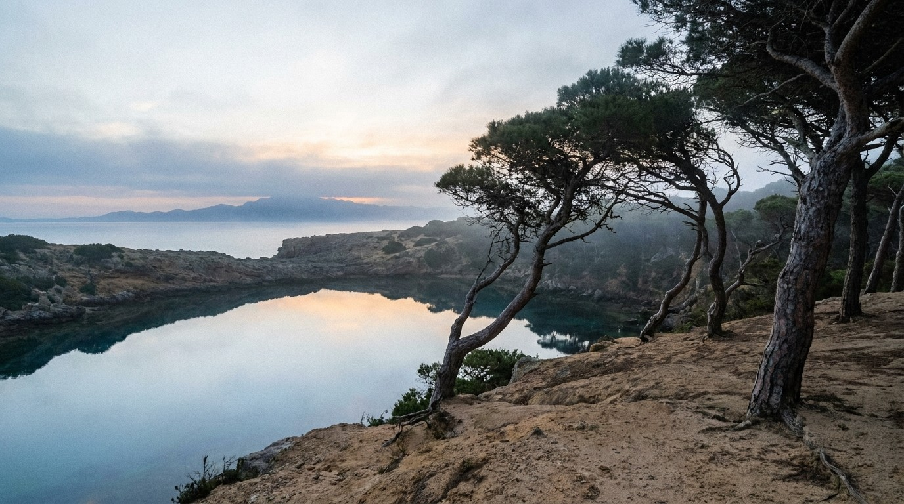


**TL;DR:** Moving to the Costa del Sol in 2026? This 40‑page desk‑researched guide gives you the complete 7‑town navigation system, verified Black Book contacts, the exact DNV income threshold, real neighborhood rents, acoustic scores, and 30+ anchoring rituals – all verified for May 2026. Instant PDF.


<a href="https://books.salahnomad.com/b/costa-del-sol-satellite-guide" class="btn-library" style="display: inline-block; background: #1a3a3a; color: #fff; padding: 1.2rem 2.8rem; text-decoration: none; font-weight: 700; font-size: 1.2rem; border-radius: 4px; letter-spacing: 0.5px; width: 100%; text-align: center; margin-bottom: 1.5rem;">📥 Get the Guide – $29</a>

---

## You cannot hack roots. But you can stop paying the "Nomad Tax."

The Costa del Sol is not one destination. It is seven distinct enclaves — each with its own fiscal logic, acoustic reality, and failure modes. This Satellite Guide is not a tourist brochure. It's a **desk‑researched navigation system** — built by cross‑referencing official sources, verified listings, and expat community intelligence.

**What the PDF helps you avoid (inside only):**
- ❌ Signing a *temporada* lease that turns into a summer eviction
- ❌ Choosing a town based on Instagram photos instead of your actual work profile
- ❌ Missing the oldest free municipal service for foreign residents in Spain (founded in 1985)
- ❌ Arriving in Tarifa in January without knowing what the Levante wind does to long‑stay residents

---

## The 5 betrayals this guide protects you from

1. **The seasonal eviction** — Most mid‑range leases are *contratos de temporada*. In July, the landlord triples the price or asks you to leave. The guide shows you how to spot the trap before you sign.

2. **The uninsurable foreigner** — Landlords reject expats because your income is unseizable by Spanish courts. Inside the guide: the exact rental dossier that makes landlords see you as a safe bet.

3. **The *padrón* paralysis** — Without your *empadronamiento*, your visa timeline freezes. The guide tells you exactly when and where to book the appointment — and what to do if you're heading for Tarifa (Cádiz province, different rules).

4. **The ático oven & the wind fatigue** — Top‑floor flats without modern HVAC become unliveable. In Tarifa, the Levante wind regularly exceeds 80 km/h. The guide scores every neighbourhood for acoustic comfort — and warns you before you commit.

5. **The expat bubble** — Arrive, socialise exclusively in English, leave within six months. The anchoring rituals in the guide are designed to stop that cycle before it starts.

---

## 🗺️ What's inside the PDF (exclusive, not listed here)

| Section | What you'll discover (only in the PDF) |
|---------|----------------------------------------|
| 🌐 **7 Towns, One Navigation System** | Torremolinos, Benalmádena, Fuengirola, Mijas, Marbella, Estepona, Tarifa — with a 3‑profile decision system (Ultra‑Connected · Autonomous · Wild). |
| ⚖️ **Bureaucracy Blueprint** | The exact D‑90 to D‑0 timeline for DNV, Beckham Law, NIE, Empadronamiento — with Andalusia‑specific processing times and the Cádiz province distinction for Tarifa. |
| 🏛️ **Verified Black Book** | Commission‑free contacts — a single multilingual lawyer covering all seven towns, specialised immigration lawyers, Beckham Law tax advisors, notaries, relocation agents, insurance brokers. All verified against official registries. |
| 📍 **Neighborhood Oracle** | Every town mapped with specific neighbourhoods that fit nomad life. Vibe, 1BR rent ranges, acoustic risk, fibre availability, and the "DA Note" that names the trap you didn't see coming. |
| 🔊 **Acoustic Sanctuary Map** | Editorial risk scores (1–10) for 13 neighbourhoods across all seven towns, based on expat field reports and ZAS mapping. |
| 💶 **No‑Surprise Budget** | Realistic monthly costs for all seven towns — solo nomad profile — plus the relocation buffer you must have before landing. |
| ⚓ **Anchoring Rituals** | More than 30 field‑tested rituals — from the C1 dawn ride to the Wind Meditation — to become a rooted local, not a revolving nomad. |
| 🚪 **When to Leave** | Strategic seasonal exits for every town — because every place on this coast has a season when it stops being yours. |
| ✅ **Pre‑arrival + First 7 days** | Step‑by‑step from landing to signed lease. |
| 🔄 **Quarterly updates** | You receive every new edition. Always download the latest version — the link never changes. |

*The exact numbers, contacts, and maps are only available inside the paid PDF – that's why it's worth $29.*

---

<!-- MARBELLA DAWN -->

  

    <h3 style="color: #1A3A3A; margin-top: 0;">🌐 Seven towns, one coastline</h3>
    
Not a list — a sorting mechanism. The guide gives you three profiles (Ultra‑Connected, Autonomous, Wild) and tells you which towns match each one.

    
Torremolinos and Benalmádena for the connected nomad. Mijas, Marbella, Estepona for those who trade connectivity for space. Tarifa for the elemental.

    
Find your profile. Choose your town.

  

  

    
  

<!-- RENTAL DOSSIER -->

  

    
  

  

    <h3 style="color: #1A3A3A; margin-top: 0;">🏘️ The 2026 rental battlefield</h3>
    
Rent per square metre, centre vs. periphery, year‑on‑year increases — for all seven towns. The "Nomad Tax" traps (Airbnb premium, agency fees, short‑term surcharge) and the relocation buffer you must have in the bank before you land.

    
The dossier that transforms you from "unknown foreigner" to "pre‑approved tenant" — and the legal framework to spot an illegal <em>Contrato de Temporada</em> before you sign.

    
Don't arrive blind. Arrive prepared.

  

<!-- WIND SANCTUARY -->

  

    <h3 style="color: #1A3A3A; margin-top: 0;">🔊 Acoustic sanctuary map</h3>
    
Editorial scores (1–10) for 13 neighbourhoods, based on expat field reports and official ZAS mapping. Not instrument‑measured. Honestly disclosed. Genuinely useful.

    
Example: Los Boliches in Fuengirola scores 8/10 for acoustic risk in summer. The guide tells you exactly why, and where to go instead.

    
Find your sanctuary. Not just a flat.

  

  

    
  

---

## Honest methodology — read this before you buy

This is a **Satellite Guide**, not a full Codex. It was produced through rigorous desk research — cross‑referencing official sources, verified listings, expat community intelligence, and independent field accounts — rather than extended personal immersion. The depth is different from the Málaga or Barcelona Codex. **The honesty is identical.**

No fabricated testimonials. No scraped blog posts. No affiliate commissions from listed professionals. Every figure has a source, every source has a date, and the Verification Log inside the PDF tells you exactly what they are.

If you need the deep, immersive, field‑tested treatment, this is not it. If you need a clear, verified, no‑nonsense map of seven towns to make an informed decision — you're in the right place.

---

## Why this costs $29

- Less than the agency fee you'll pay if you sign the wrong lease clause.
- Less than one night in an Airbnb you'll need because your *padrón* appointment wasn't booked.
- Less than the difference between a *temporada* rent hike and a protected annual contract — for one single month.

---

## ❓ Frequently asked questions


Yes. Every figure — rent averages, DNV threshold, Beckham Law conditions, acoustic scores, Black Book contacts — has been verified against official sources (Real Decreto 126/2026, Engel & Völkers, Fotocasa, Indomio, Idealista, Ayuntamiento de Mijas). The PDF includes a **Verification Log** with dates and sources.



This guide was produced through rigorous desk research — cross‑referencing official sources, verified listings, and expat community reports — rather than extended personal immersion. It covers seven towns instead of one deep dive. The depth is different. The honesty is the same.



All buyers receive an email notification when a new version is released. The download link stays the same — you'll always get the latest edition, with no time limit.


---

## Bundle & Save

| Bundle | Guides Included | Price | Saving |
|--------|----------------|-------|--------|
| 🇪🇸 [Ultimate Spain Bundle](https://books.salahnomad.com/b/ultimate-spain-bundle) | Málaga + Valencia + Sevilla + Barcelona | $89 | Save $27 |
| 🌊 [Full Mediterranean Collection](https://books.salahnomad.com/b/full-mediterranean-collection) | All 5 guides including Barcelona | $119 | Save $46 |
| 🇪🇸 [Spain Complete Bundle](https://books.salahnomad.com/b/spain-complete-bundle) | All 7 guides including Madrid | $169 | Save $54 |

[Explore the Full Collection →](https://books.salahnomad.com)

---

## The Complete Mediterranean Codex System

The Costa del Sol Satellite Guide is part of a field‑verified system covering Southern Spain's key relocation destinations.

| City | Status | Price | Edition |
|------|--------|-------|---------|
| 🇪🇸 [Málaga — The Lighthouse](https://books.salahnomad.com/b/malaga-relocation-checklist) | ✅ Available | $29 | May 2026 |
| 🇪🇸 [Barcelona — The Tech Capital](https://books.salahnomad.com/b/barcelona-relocation-codex) | ✅ Available | $39 | April 2026 |
| 🇪🇸 [Valencia — The Mediterranean Corridor](https://books.salahnomad.com/b/valencia-relocation-checklist-2026) | ✅ Available | $29 | May 2026 |
| 🇪🇸 [Seville — The Ancestral Soul](https://books.salahnomad.com/b/seville-relocation-codex) | ✅ Available | $29 | April 2026 |
| 🇪🇸 [Granada — The Altitude Sanctuary](https://books.salahnomad.com/b/granada-relocation-codex) | ✅ Available | $29 | April 2026 |
| 🛰️ [Costa del Sol — The Satellites](https://books.salahnomad.com/b/costa-del-sol-satellite-guide) | ✅ Available | $29 | May 2026 |
| 🏛️ [Madrid — The Continental Chess Game](https://books.salahnomad.com/b/madrid-relocation-codex) | ✅ Available | $39 | June 2026 |

*Want the philosophy behind the system? Read [Algorithmic Sardines](https://books.salahnomad.com/b/algorithmic-sardines) — the book that explains why roots matter more than routes.*

---

<a href="https://books.salahnomad.com/b/costa-del-sol-satellite-guide" class="btn-library" style="display: inline-block; background: #C9A227; color: #1A3A3A; padding: 1.2rem 2.8rem; text-decoration: none; font-weight: 700; font-size: 1.1rem; border-radius: 4px; letter-spacing: 0.5px; width: 100%; text-align: center; box-sizing: border-box;">Get the Costa del Sol Satellite Guide — $29 →</a>

*Instant PDF download · May 2026 Edition · Verified & Corrected · Edition 2026.4 FINAL*

---

  © 2026 Mediterranean Codex Series by Salah Nomad. All rights reserved. 
  <strong>Download limit:</strong> Your purchase includes 5 downloads. Please save your file securely. If you exceed this limit, a new purchase is required. 
  <strong>Updates included:</strong> This guide is updated quarterly. When you download the file, you always get the latest version — no need to buy again for the current edition. 
  Current version: <a href="https://salahnomad.com/costadelsol">salahnomad.com/costadelsol</a>  
  <strong>Disclaimer:</strong> This guide does not constitute legal, fiscal, or immigration advice. Consult a qualified professional for your personal situation. Black Book entries verified May 2026 — confirm current details before engagement.  
  Explore the Full Collection: <a href="https://books.salahnomad.com">books.salahnomad.com</a>

