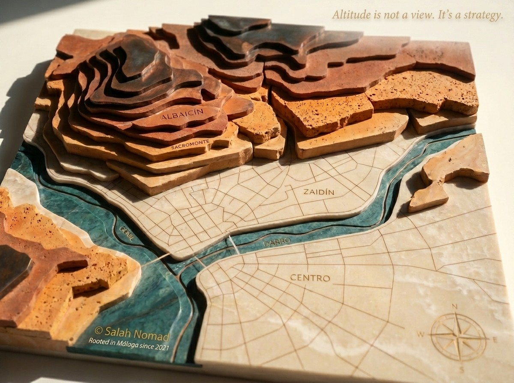
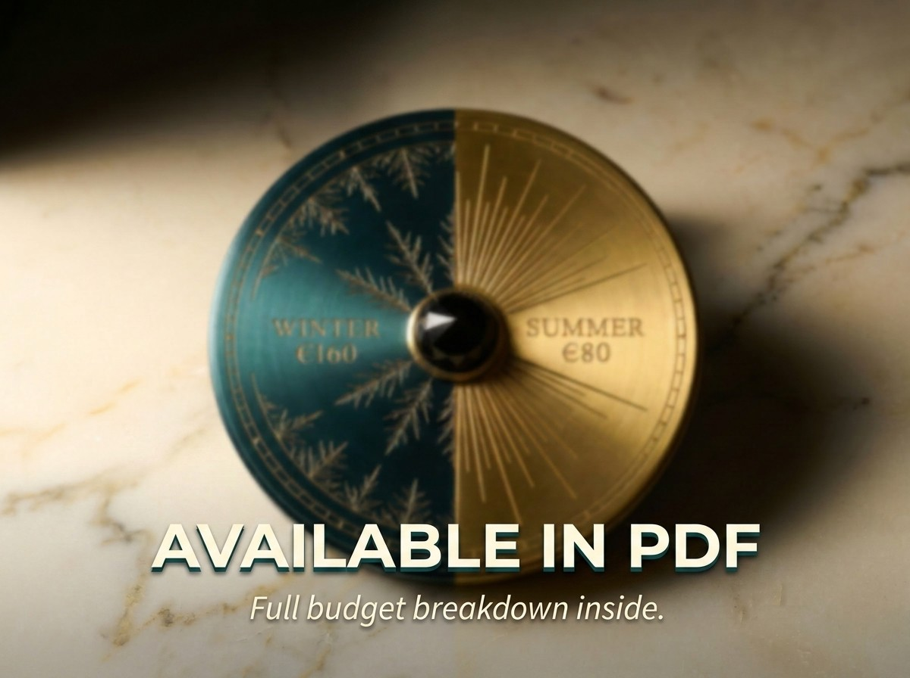
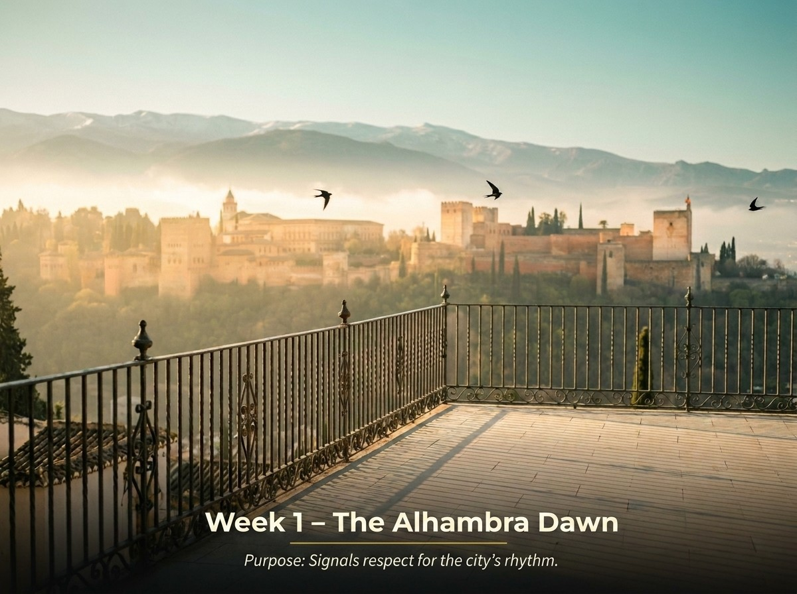
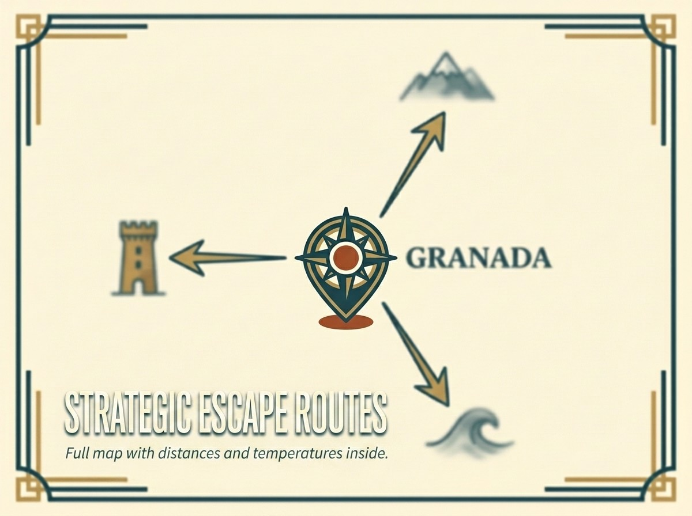


**TL;DR:** Moving to Granada in 2026? This 27‑page field‑tested codex gives you the exclusive Altitude & Thermal Sanctuary Map, verified Black Book contacts, the exact DNV income threshold, real neighborhood rents, and anchoring rituals – all verified for April 2026. Instant PDF.


<a href="https://books.salahnomad.com/b/granada-relocation-codex" class="btn-library" style="display: inline-block; background: #1a3a3a; color: #fff; padding: 1.2rem 2.8rem; text-decoration: none; font-weight: 700; font-size: 1.2rem; border-radius: 4px; letter-spacing: 0.5px; width: 100%; text-align: center; margin-bottom: 1.5rem;">📥 Get the Blueprint – $29</a>

<!-- IMAGE HERO (pleine largeur) -->


---

## You cannot hack roots. But you can stop paying the "Nomad Tax."

Granada in 2026 is not the postcard you see on Instagram. At **738 meters altitude**, summers hit **41°C by day** – but nights drop to 18°C. Winters bring **-2°C freezes** and heating bills that crush unprepared budgets.

This is not a tourist brochure. It's a **field‑tested operational manual** – built over 3 months of on‑ground research with 4 local partners.

**What the PDF helps you avoid (inside only):**
- ❌ Signing a lease in a thermal trap neighborhood (€1,200–2,500 in broken lease costs)
- ❌ Falling for the "Contrato de Temporada" loophole (€3,200+ in disruption)
- ❌ Freezing in an Albaicín apartment with no central heating (€200+/month bills)
- ❌ The "fiber-ready" listings that deliver 10 Mbps in protected historic zones

---

## 🗺️ What's inside the PDF (exclusive, not listed here)

| Section | What you'll discover (only in the PDF) |
|---------|----------------------------------------|
| 🌡️ **Altitude & Thermal Sanctuary Map** | Proprietary scoring model for 8 neighborhoods: summer comfort, winter heating reality, acoustic pollution, fiber availability. Avoid the red zones before you sign. |
| ⚖️ **Bureaucracy Blueprint** | The exact D‑60 to D‑0 timeline for DNV, NL Visa, NIE, Empadronamiento – with apostille expiration traps and Andalusia‑specific processing times. |
| 🏛️ **Verified Black Book** | Transparent, commission‑free resources. National‑level immigration contacts, MAEC sworn translator directory, and field‑tested coworking spaces. |
| 📍 **Neighborhood Oracle** | 8 barrio archetypes with real 2026 rents, altitude-adjusted comfort scores, and fiber reality – so you don't overpay for a postcard. |
| 💶 **No‑Surprise Budget** | Realistic monthly costs (winter ~€1,730 vs. summer ~€1,650), including the "Altitude Survival" surcharge and fixed‑rate electricity strategy. |
| ⚓ **Anchoring Rituals** | 5 sensory practices (Alhambra dawn, tapeo circuito, Hammam immersion, Sierra Nevada escape, flamenco in Sacromonte) to become a rooted local in 30 days. |
| 🚪 **When to Leave (Escape Routes)** | Strategic winter exits to Costa Tropical (18-22°C in January) and summer refuges in Sierra Nevada – plus lease termination leverage. |
| ✅ **Pre‑arrival + First 7 days** | Step‑by‑step from landing to signed lease. |
| 🔄 **Quarterly updates** | You receive every new edition for 1 year. |

*The exact numbers, contacts, and maps are only available inside the paid PDF – that's why it's worth $29.*

---

<!-- SECTION ALTITUDE MAP (texte à gauche, image à droite) -->

  

    <h3 style="color: #1A3A3A; margin-top: 0;">🌡️ The Altitude & Thermal Sanctuary Map</h3>
    
At 738m, Granada's microclimates change block by block. Some neighborhoods freeze in winter; others bake in summer.

    
Inside the PDF, you unlock the exact street‑level scores (Green/Yellow/Red) you must avoid to prevent signing a toxic 12‑month lease.

    
Don't sign a lease blind.

  

  

    
  

<!-- SECTION BLACK BOOK (image à gauche, texte à droite) -->

  

    
  

  

    <h3 style="color: #1A3A3A; margin-top: 0;">🏛️ Verified Black Book</h3>
    
Transparent, commission‑free resources. National‑level immigration contacts, MAEC sworn translators, field‑tested coworking spaces.

    
We tell you exactly which category we refused to recommend locally – and why.

    
The resources you can trust.

  

<!-- SECTION BUDGET (texte à gauche, image à droite) -->

  

    <h3 style="color: #1A3A3A; margin-top: 0;">💶 No‑Surprise Budget (Two‑Season Reality)</h3>
    
Winter (~€1,730) vs. Summer (~€1,650). Heating is the real budget killer in Granada, not AC.

    
Includes the "Altitude Survival" surcharge and how to lock in a fixed‑rate electricity contract before winter spikes.

    
Budget with confidence.

  

  

    
  

<!-- SECTION RITUALS (image à gauche, texte à droite) -->

  

    
  

  

    <h3 style="color: #1A3A3A; margin-top: 0;">⚓ Anchoring Rituals – The Granadino Code</h3>
    
5 sensory practices (Alhambra dawn, tapeo protocol, Hammam immersion, Sierra Nevada escape, flamenco in Sacromonte) to become a rooted local in 30 days.

    
Integration is ritual. These habits transform you from digital ghost to recognized neighbor.

    
Belong, not just live.

  

<!-- SECTION ESCAPE ROUTES (texte à gauche, image à droite) -->

  

    <h3 style="color: #1A3A3A; margin-top: 0;">🚪 When to Leave (Escape Routes)</h3>
    
Granada's beauty comes with extremes. Winter cold? Costa Tropical is 60 minutes south (18-22°C in January). Summer heat? Sierra Nevada is 45 minutes away (-10°C).

    
Inside the PDF: exact distances, temperatures, and how to use your lease to walk away cleanly.

    
Know when to anchor. Know when to sail.

  

  

    
  

---

## 💬 What early readers say


"I almost rented in the Albaicín for the views. The Altitude Map made me check the heating type first. Electric radiators only. I walked away and found a modern place in Zaidín with central gas. This codex saved me €200/month this winter."



"The Contrato de Temporada section is pure gold. I used the exact phrasing and got the landlord to agree to a CPI cap. He said no other foreigner had ever asked for that. Game changer."


---

## ❓ Frequently asked questions


Yes. Every figure – rent averages, DNV threshold, Beckham Law conditions, altitude-adjusted comfort scores – has been verified against official sources (Real Decreto 126/2026, AEMET climate data, Granada City Council noise maps, Idealista trend data). The PDF includes a **Verification Log** with dates and sources.



Free blogs give you generic advice. This PDF gives you **exclusive, field‑verified data** – the Altitude & Thermal Sanctuary Map, the exact Black Book resources, the real 2026 budget (winter vs. summer), and the step‑by‑step bureaucracy timeline. It's the shortcut that saves you weeks of research and thousands in mistakes.



All buyers receive an email notification when a new version is released. The download link stays the same – you'll always get the latest edition.


---

## 📦 Bundle & save

Already own the [Málaga Relocation Checklist](/offers/malaga-relocation-checklist/)? Add the **Granada edition** for only **$15** during checkout (total $49).  
Perfect if you're still comparing Andalusian anchors before making your final decision.

---

<a href="https://books.salahnomad.com/b/granada-relocation-codex" class="btn-library" style="display: inline-block; background: #C9A227; color: #1A3A3A; padding: 1.2rem 2.8rem; text-decoration: none; font-weight: 700; font-size: 1.2rem; border-radius: 4px; letter-spacing: 0.5px; width: 100%; text-align: center;">👉 Download the Codex – $29</a>

*Instant PDF download*

---

  Rooted in Málaga since 2021 – now helping you root in Granada. 
  <strong>— Salah Nomad</strong> 
  <em>Mediterranean Codex System – April 2026</em>

