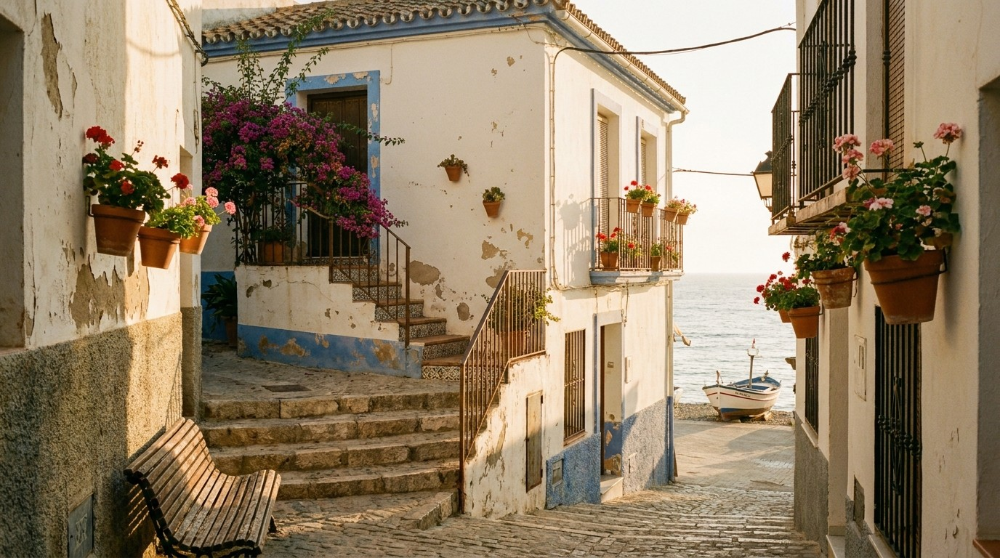


**TL;DR:** Moving to Málaga in 2026 is expensive and bureaucratic if you fly blind. This **30‑page PDF** gives you the exact sequence to settle in 7 days – without paying the "Nomad Tax" on rent, visas, or bad contracts.


---

## Why Málaga Is Not Just Another Spanish City

Málaga operates under Andalusia's fiscal framework — the most tax‑efficient in Spain for high‑net‑worth nomads (100% Wealth Tax exemption). The rental market has seen **15–20% year‑on‑year increases** in coastal barrios like Pedregalejo. The acoustic environment is officially mapped, regulated, and enforceable.

None of this appears in free blogs. All of it is in this guide.

---

## What You Get

| Chapter | What It Covers |
|---------|----------------|
| 🏚️ **Housing Emergency Kit** | The 2026 rental battlefield, the predatory *Contrato de Temporada* trap, how to beat the landlord filter as a foreigner, your rental dossier, and the realistic Relocation Buffer |
| 🗺️ **Fiscal & Acoustic Sanctuary Map** | Neighbourhood-by-neighbourhood acoustic risk scores (1‑10) and fiscal exposure ratings — where to live, and where to avoid |
| 🏛️ **The Bureaucracy Blueprint** | DNV (€2,849/month threshold), NLV, Beckham Law filing, NIE/TIE — with real-world Andalusia timelines |
| 📖 **Verified Black Book** | Commission-free, ICAM-verified immigration lawyers, fiscalists, notaries, NIE/TIE specialists, and a nomad‑friendly bank — with exact fees and who to ask for |
| 🏘️ **Neighborhood Oracle** | 6 barrio archetypes with 2026 rents, acoustic scores, fiber reality, and the right archetype for your work style |
| 💶 **No-Surprise Budget** | Winter vs. summer two-season reality, one-time setup costs, and the Housing Buffer calculation |
| ⚓ **Anchoring Rituals** | The Pedregalejo Code — 5 field-tested practices to become a rooted local, not a revolving nomad |
| ✅ **Pre-Arrival Checklist** | D-90 to D-1: the exact sequence from your home country to your first signed lease |
| 📅 **First 7 Days Schedule** | Day-by-day protocol from arrival to bureaucracy initiation to your first sunset espeto |
| 🔄 **Quarterly Updates** | Every new edition for 12 months — included in your purchase |

*The exact numbers, contacts, maps, and legal clauses are only inside the paid PDF.*

---

<!-- HOUSING EMERGENCY KIT SECTION -->

  

    <h3 style="color: #1A3A3A; margin-top: 0;">🏚️ Housing Emergency Kit</h3>
    
Málaga's rental market in 2026 is not the same as 2024. Pedregalejo rents have increased 15‑20% year‑on‑year. Landlords reject foreign applicants systematically — not because of nationality, but because your income is unseizable by Spanish courts.

    
Inside the Codex, you get the exact rental dossier that transforms you from "unknown foreigner" to "pre‑approved tenant" — and the legal framework to spot an illegal <em>Contrato de Temporada</em> before you sign.

    
Don't arrive blind. Arrive prepared.

  

  

    
  

<!-- SANCTUARY MAP SECTION -->

  

    
  

  

    <h3 style="color: #1A3A3A; margin-top: 0;">🗺️ Fiscal & Acoustic Sanctuary Map</h3>
    
In Málaga, your neighbourhood choice is not aesthetic. It is fiscal and physiological.

    
The Codex maps every major neighbourhood by acoustic risk (the official <em>Mapa Estratégico de Ruido</em>) and fiscal exposure — so you know where to anchor before you search a single listing.

    
Find your sanctuary. Not just a flat.

  

<!-- BLACK BOOK SECTION -->

  

    <h3 style="color: #1A3A3A; margin-top: 0;">📖 Verified Black Book</h3>
    
Every contact is commission‑free, ICAM‑verified, and field‑tested with real client timelines and fees.

    
Immigration lawyers who resolve complex DNV cases others reject. Fiscalists who specialise in the Beckham Law + Andalusia Wealth Tax exemption. Málaga's most‑reviewed notary for property documents. A NIE/TIE speed specialist with a proven track record securing scarce <em>cita previa</em> slots.

    
The contacts you can trust. Verified May 2026.

  

  

    
  

<!-- ANCHORING RITUALS SECTION -->

  

    
  

  

    <h3 style="color: #1A3A3A; margin-top: 0;">⚓ The Pedregalejo Code</h3>
    
Relocation is logistics. Integration is ritual.

    
The Codex includes 5 field‑tested anchoring practices — from the baker who learns your name, to the Friday sunset espeto that becomes your weekly reset, to the bench where you finally stop running. These are not "things to do". They are rites of passage.

    
Belong. Don't just live.

  

---

## What This Is Not

<ul style="list-style-type: none; padding-left: 0;">
  <li style="margin-bottom: 8px;">✗ Not a tourist guide</li>
  <li style="margin-bottom: 8px;">✗ Not "top 10 tapas bars in Málaga"</li>
  <li style="margin-bottom: 8px;">✗ No theory — only field‑tested, source‑verified data</li>
  <li style="margin-bottom: 8px;">✗ No unverifiable contacts</li>
  <li style="margin-bottom: 8px;">✗ No affiliate commissions from listed professionals</li>
  <li style="margin-bottom: 8px;">✗ No fabricated testimonials</li>
</ul>

> *"May you find your soil sooner than I did."*
> **— Salah Nomad, Pedregalejo, Málaga, May 2026**

---

## Who This Is For

**This guide is for you if:**

- You are a remote worker, freelancer, or digital nomad planning to relocate to Málaga in the next 6 months
- You earn in USD, GBP, EUR, or another foreign currency and need to understand the Andalusian fiscal landscape before committing
- You have looked at Málaga listings on Idealista and felt the market was incomprehensible
- You want to activate the Digital Nomad Visa or evaluate the Beckham Law — and need accurate May 2026 data, not a 2023 blog post
- You value your time at more than the cost of a single mistake avoided

**This guide is not for you if:**

- You are looking for general Spain travel advice
- You are planning a stay of less than 3 months
- You are not prepared to engage with legal and fiscal complexity

---

## The 2026 Rental Reality — In Numbers

The data that matters is inside the PDF. But here is the context:

Málaga's rental market in 2026 is under severe pressure. Pedregalejo — once the quiet local haven — has seen price surges of 15–20% year‑on‑year. Centro Histórico has become an acoustic emergency zone (9/10 risk) for remote workers. The gap between what you see on a portal and what a prepared foreigner can actually access is the core intelligence this guide delivers.

**The *Contrato de Temporada* trap** is the single most expensive mistake new arrivals make. Most landlords, most agencies, and most expat forums have not caught up. This guide has.

---

## The Fiscal Advantage Most Nomads Discover Too Late

Andalusia is Spain's most tax‑efficient region for high‑net‑worth individuals. The 100% Wealth Tax exemption — unique to Andalusia — can save you thousands of euros per year compared to Catalonia or Madrid.

The Codex maps this landscape clearly — and tells you exactly when to consult a Málaga fiscal specialist, and which one.

*The Codex does not constitute legal or fiscal advice. It maps the terrain. Your specialist navigates it.*

---

## Frequently Asked Questions


Yes. Every figure — rent averages, DNV income threshold (€2,849/month gross per Real Decreto 126/2026), acoustic risk scores, Black Book contact fees — has been verified against official sources. The PDF includes a Verification Log with exact dates and source references.



Because Málaga operates under Andalusia's simpler fiscal and rental framework. Barcelona's Law 11/2025, higher Wealth Tax exposure, and significantly more competitive rental market require deeper research and a larger verified contact network. The $29 reflects the complexity of the market — not a quality difference.



Yes. The two guides share the same editorial DNA — field‑verified data, Black Book contacts, acoustic mapping — but Málaga operates under Andalusia's distinct legal and fiscal framework. The Wealth Tax exemption is different (100% vs. Catalonia's €500,000 threshold). The rental market dynamics are different. The bureaucracy timelines are different. The Málaga Codex is not a template — it is a separate field investigation.



The Mediterranean Duo gives you any two city guides for $49 — saving $9 versus separate purchases. If you are comparing Málaga with Barcelona, Valencia, Seville, or Granada, the bundle is the right entry point. Each guide uses the same evaluation framework, so comparison is direct.



All buyers receive an email notification when a new version is released. The download link on Payhip stays the same — you always access the latest edition at no additional cost. The next scheduled update is Q3 2026.



No. The Málaga Relocation Codex is field intelligence — verified data, mapped risks, and vetted contacts. It tells you what to look for and who to call. The Verified Black Book professionals provide the qualified advice for your specific situation.


---

## Bundle & Save

Already own the [Barcelona Relocation Codex](/offers/barcelona-relocation-codex/) ($39)?

Add the **Málaga Codex** for only **$29** during checkout — total **$68**, saving $9 versus separate purchase.

Or go deeper with the **Mediterranean Bundle**:

| Bundle | Guides Included | Price | Saving |
|--------|----------------|-------|--------|
| Andalucía Duo | Any 2 guides | $49 | Save $9 |
| Southern Spain Collection | Málaga + Valencia + Seville + Granada | $89 | Save $27 |
| Full Mediterranean | All 5 guides including Barcelona | $119 | Save $46 |

*All bundles include quarterly updates for 12 months.*

---

## The Complete Mediterranean Codex System

The Málaga Relocation Codex is part of a field‑verified system covering Southern Spain's key relocation destinations.

| City | Status | Price | Edition |
|------|--------|-------|---------|
| 🇪🇸 **Málaga** — The Lighthouse | ✅ Available | $29 | May 2026 |
| 🇪🇸 **Barcelona** — The Tech Capital | ✅ Available | $39 | April 2026 |
| 🇪🇸 **Valencia** — The Mediterranean Corridor | ✅ Available | $29 | April 2026 |
| 🇪🇸 **Seville** — The Ancestral Soul | ✅ Available | $29 | April 2026 |
| 🇪🇸 **Granada** — The Altitude Sanctuary | ✅ Available | $29 | April 2026 |
| 🛰️ **Satellites** (Marbella, Tarifa, Fuengirola) | ⏳ Waitlist | — | Coming 2026 |

*Want the philosophy behind the system? Read [Algorithmic Sardines](/offers/algorithmic-sardines/) — the book that explains why roots matter more than routes.*

---

<a href="https://books.salahnomad.com/b/malaga-relocation-checklist" class="btn-library" style="display: inline-block; background: #C9A227; color: #1A3A3A; padding: 1.2rem 2.8rem; text-decoration: none; font-weight: 700; font-size: 1.1rem; border-radius: 4px; letter-spacing: 0.5px; width: 100%; text-align: center; box-sizing: border-box;">Get the Málaga Relocation Codex — $29 →</a>

*Instant PDF download · May 2026 Edition · Verified & Corrected · Edition 2026.3 Final+*

---

  Rooted in Málaga since 2021 — field research conducted in Pedregalejo, May 2026. 
  <strong>— Salah Nomad</strong> 
  <em>Mediterranean Codex System · salahnomad.com/malaga</em>  
  <strong>Disclaimer:</strong> This guide does not constitute legal, fiscal, or immigration advice. Consult a qualified professional for your personal situation. Black Book entries verified May 2026 — confirm current details before engagement. Purchasers receive update notifications by email — keep your receipt.

