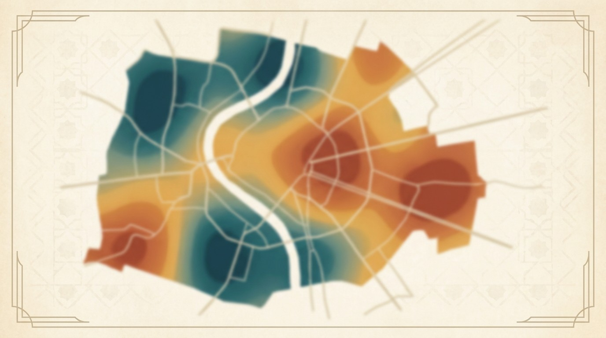
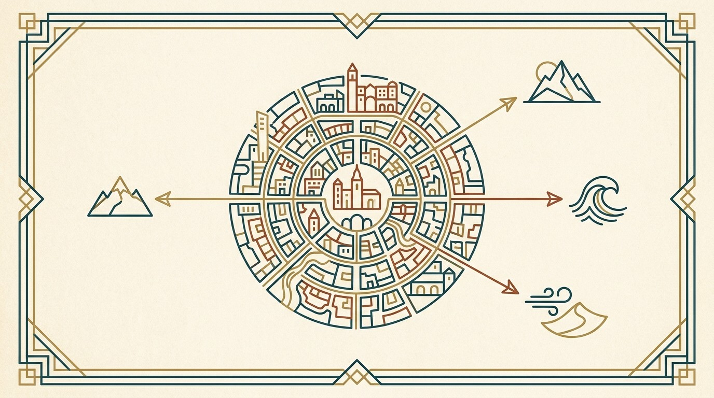


**TL;DR:** Moving to Seville in 2026? This 30‑page field‑tested codex gives you the exclusive Thermal & Acoustic Sanctuary Map, 27 verified Black Book contacts, the exact DNV income threshold, real neighborhood rents, and anchoring rituals – all verified for June 2026. Instant PDF.


<!-- Bandeau CTA flottant (simple bouton en haut) -->

  <strong style="font-size: 1.2rem;">June 2026 Edition – 27 Verified Contacts – $29</strong> 
  <a href="https://books.salahnomad.com/b/seville-relocation-codex" style="display: inline-block; background: #C9A227; color: #1A3A3A; padding: 0.6rem 1.5rem; margin-top: 0.5rem; text-decoration: none; font-weight: bold; border-radius: 4px;">👉 Buy Now – Instant PDF</a>

<a href="https://books.salahnomad.com/b/seville-relocation-codex" class="btn-library" style="display: inline-block; background: #1a3a3a; color: #fff; padding: 1.2rem 2.8rem; text-decoration: none; font-weight: 700; font-size: 1.2rem; border-radius: 4px; letter-spacing: 0.5px; width: 100%; text-align: center; margin-bottom: 1.5rem;">📥 Get the Blueprint – $29</a>

<!-- IMAGE HERO (pleine largeur) – une seule image, pas de doublon -->


---

## You cannot hack roots. But you can stop paying the "Nomad Tax."

Seville in 2026 is not the postcard you see on Instagram. Summers now hit **45°C (113°F)**. Rents have surged. And the 2025 heat records proved one thing: *water remembers what humans forget, and heat remembers what tourists ignore.*

This is not a tourist brochure. It's a **field‑tested operational manual** – built over 3 months of on‑ground research with 4 local partners (immigration lawyers, property managers, gestorías).

**What the PDF helps you avoid (inside only):**
- ❌ Signing a lease in a thermal trap neighborhood (€1,200–2,500 in broken lease costs)
- ❌ Falling for the "Contrato de Temporada" loophole (€3,200+ in disruption)
- ❌ Wasting weeks on *Padrón* appointments during Feria chaos
- ❌ The overpriced "charming" neighborhoods that destroy your sleep during Semana Santa

---

## 🗺️ What's inside the PDF (exclusive, not listed here)

| Section | What you'll discover (only in the PDF) |
|---------|----------------------------------------|
| 🌡️ **Thermal & Acoustic Sanctuary Map** | Proprietary scoring model (1–10) for every neighborhood: thermal retention, noise pollution, fiber availability. Avoid the red zones before you sign. |
| ⚖️ **Bureaucracy Blueprint** | The exact D‑60 to D‑0 timeline for DNV, NL Visa, NIE, Empadronamiento – with apostille expiration traps and Andalusia‑specific processing times. |
| 🏛️ **Verified Black Book** | 27 commission‑free contacts (immigration lawyers, gestorías, sworn translators). All tested for English/Spanish fluency and DNV/Beckham Law expertise. |
| 📍 **Neighborhood Oracle** | 8 barrio archetypes with real 2026 rents, thermal scores, and acoustic ratings – so you don't overpay for a postcard. |
| 💶 **No‑Surprise Budget** | Realistic monthly costs, including the "Summer Oven" AC spike (+€90/month) and 21% IVA on coworking. |
| ⚓ **Anchoring Rituals** | 5 sensory practices (Plaza de España dawn walk, Triana market protocol, peña flamenca immersion) to become a rooted local in 30 days. |
| 🚪 **When to Leave (Escape Routes)** | Strategic summer exits to Ronda, Cádiz, and Tarifa – plus lease termination leverage. |
| ✅ **Pre‑arrival + First 7 days** | Step‑by‑step from landing to signed lease. |
| 🔄 **Quarterly updates** | You receive every new edition for 12 months. |

*The exact numbers, contacts, and maps are only available inside the paid PDF – that's why it's worth $29.*

---

<!-- SECTION THERMAL MAP (texte à gauche, image à droite) -->

  

    <h3 style="color: #1A3A3A; margin-top: 0;">🌡️ The Thermal & Acoustic Sanctuary Map</h3>
    
After the 2025 heat records (30 days above 40°C), the housing map changed completely. Some historic neighborhoods become unlivable ovens.

    
Inside the PDF, you unlock the exact street‑level thermal and acoustic scores (Green/Yellow/Red) you must avoid to prevent signing a toxic 12‑month lease.

    
Don't sign a lease blind.

  

  

    
  

<!-- SECTION BLACK BOOK (image à gauche, texte à droite) -->

  

    
  

  

    <h3 style="color: #1A3A3A; margin-top: 0;">🏛️ Verified Black Book</h3>
    
27 commission‑free contacts. Lawyers, gestorías, sworn translators.

    
All tested for English/Spanish fluency and DNV/Beckham Law expertise. Zero affiliate links. We even tell you which category we refused to recommend – and why.

    
The contacts you can trust. Verified June 2026.

  

<!-- SECTION BUDGET (texte à gauche, image à droite) -->

  

    <h3 style="color: #1A3A3A; margin-top: 0;">💶 No‑Surprise Budget (Two‑Season Reality)</h3>
    
Realistic monthly costs (€2,000–2,400), including the "Summer Oven" AC spike and 21% IVA on coworking.

    
No fake "cheap Spain" numbers. This is what Seville actually costs in 2026 – winter vs. summer.

    
Budget with confidence.

  

  

    
  

<!-- SECTION RITUALS (image à gauche, texte à droite) -->

  

    
  

  

    <h3 style="color: #1A3A3A; margin-top: 0;">⚓ Anchoring Rituals – The Sevillano Code</h3>
    
5 sensory practices (Plaza de España dawn walk, Triana market protocol, peña flamenca immersion, tapeo ritual, Semana Santa respect) to become a rooted local in 30 days.

    
Integration is ritual. These habits transform you from digital ghost to recognized neighbor.

    
Belong, not just live.

  

<!-- SECTION ESCAPE ROUTES (texte à gauche, image à droite) -->

  

    <h3 style="color: #1A3A3A; margin-top: 0;">🚪 When to Leave (Escape Routes)</h3>
    
August in Seville is not a test of willpower – it's a physiological reality. Even locals flee.

    
Inside the PDF: strategic summer exits to Ronda (-8°C), Cádiz (Atlantic breeze), and Tarifa (cool winds) – plus exactly how to use your lease to walk away cleanly.

    
Know when to anchor. Know when to sail.

  

  

    
  

---

## 💬 What early readers say


"I was about to sign a lease in a 'charming' street. The Thermal Sanctuary Map made me audit the block at the right time of day. I walked away. Best decision I made. This codex saved me thousands."



"The Contrato de Temporada section alone is worth the price. I used the exact phrasing from the PDF and secured a protected lease addendum the same day. My landlord was surprised I knew the loophole."


---

## ❓ Frequently asked questions


Yes. Every figure – rent averages, DNV threshold, Beckham Law conditions, thermal scores – has been verified against official sources (Real Decreto 126/2026, AEMET climate data, Seville City Council noise maps, Idealista trend data). The PDF includes a **Verification Log** with dates and sources.



Free blogs give you generic advice. This PDF gives you **exclusive, field‑verified data** – the Thermal & Acoustic Sanctuary Map, the exact 27 Black Book contacts, the real 2026 budget (winter vs. summer), and the step‑by‑step bureaucracy timeline. It's the shortcut that saves you weeks of research and thousands in mistakes.



All buyers receive an email notification when a new version is released. The download link stays the same – you'll always get the latest edition.


---

## Bundle & Save

| Bundle | Guides Included | Price | Saving |
|--------|----------------|-------|--------|
| 🇪🇸 [Ultimate Spain Bundle](https://books.salahnomad.com/b/ultimate-spain-bundle) | Málaga + Valencia + Sevilla + Barcelona | $89 | Save $27 |
| 🌊 [Full Mediterranean Collection](https://books.salahnomad.com/b/full-mediterranean-collection) | All 5 guides including Barcelona | $119 | Save $46 |
| 🇪🇸 [Spain Complete Bundle](https://books.salahnomad.com/b/spain-complete-bundle) | All 7 guides including Madrid | $169 | Save $54 |

[Explore the Full Collection →](https://books.salahnomad.com)

---

## The Complete Mediterranean Codex System

The Seville Relocation Codex is part of a field‑verified system covering Southern Spain's key relocation destinations.

| City | Status | Price | Edition |
|------|--------|-------|---------|
| 🇪🇸 [Málaga — The Lighthouse](https://books.salahnomad.com/b/malaga-relocation-checklist) | ✅ Available | $29 | May 2026 |
| 🇪🇸 [Barcelona — The Tech Capital](https://books.salahnomad.com/b/barcelona-relocation-codex) | ✅ Available | $39 | April 2026 |
| 🇪🇸 [Valencia — The Mediterranean Corridor](https://books.salahnomad.com/b/valencia-relocation-checklist-2026) | ✅ Available | $29 | May 2026 |
| 🇪🇸 [Seville — The Ancestral Soul](https://books.salahnomad.com/b/seville-relocation-codex) | ✅ Available | $29 | June 2026 |
| 🇪🇸 [Granada — The Altitude Sanctuary](https://books.salahnomad.com/b/granada-relocation-codex) | ✅ Available | $29 | April 2026 |
| 🛰️ [Costa del Sol — The Satellites](https://books.salahnomad.com/b/costa-del-sol-satellite-guide) | ✅ Available | $29 | May 2026 |
| 🏛️ [Madrid — The Continental Chess Game](https://books.salahnomad.com/b/madrid-relocation-codex) | ✅ Available | $39 | June 2026 |

*Want the philosophy behind the system? Read [Algorithmic Sardines](https://books.salahnomad.com/b/algorithmic-sardines) — the book that explains why roots matter more than routes.*

---

<a href="https://books.salahnomad.com/b/seville-relocation-codex" class="btn-library" style="display: inline-block; background: #C9A227; color: #1A3A3A; padding: 1.2rem 2.8rem; text-decoration: none; font-weight: 700; font-size: 1.2rem; border-radius: 4px; letter-spacing: 0.5px; width: 100%; text-align: center;">👉 Download the Codex – $29</a>

*Instant PDF download*

---

  © 2026 Mediterranean Codex Series by Salah Nomad. All rights reserved. 
  <strong>Download limit:</strong> Your purchase includes 5 downloads. Please save your file securely. If you exceed this limit, a new purchase is required. 
  <strong>Updates included:</strong> This guide is updated quarterly. When you download the file, you always get the latest version — no need to buy again for the current edition. 
  Current version: <a href="https://salahnomad.com/seville">salahnomad.com/seville</a>  
  <strong>Disclaimer:</strong> This guide does not constitute legal, fiscal, or immigration advice. Consult a qualified professional for your personal situation. Black Book entries verified June 2026 — confirm current details before engagement.  
  Explore the Full Collection: <a href="https://books.salahnomad.com">books.salahnomad.com</a>

