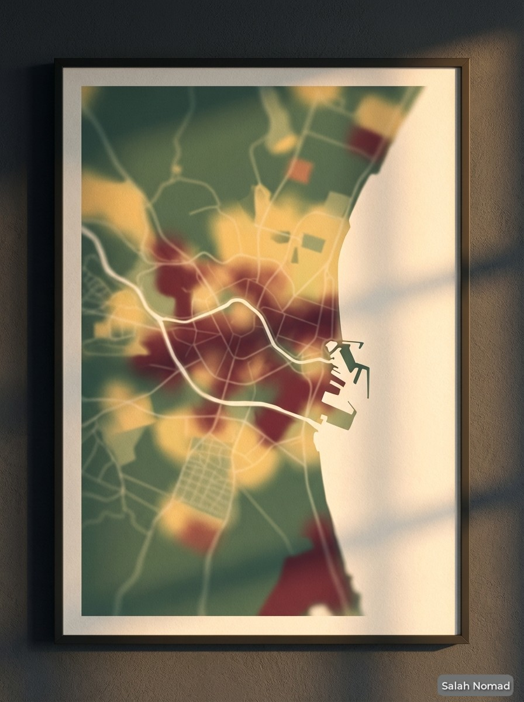
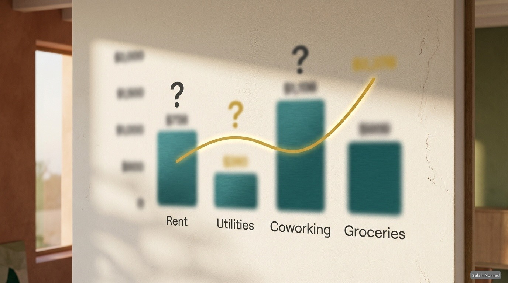


**TL;DR:** Moving to Valencia in 2026? This 24‑page field‑tested checklist gives you the exclusive DANA flood risk map, 12 verified Black Book contacts, the exact DNV income threshold, real neighborhood rents, and anchoring rituals – all verified for March 2026. Instant PDF.


<a href="https://books.salahnomad.com/b/valencia-relocation-checklist-2026" class="btn-library" style="display: inline-block; background: #1a3a3a; color: #fff; padding: 1.2rem 2.8rem; text-decoration: none; font-weight: 700; font-size: 1.2rem; border-radius: 4px; letter-spacing: 0.5px; width: 100%; text-align: center; margin-bottom: 1.5rem;">📥 Get the Blueprint – $29</a>

<!-- IMAGE HERO (pleine largeur) -->


---

## You cannot hack roots. But you can stop paying the “Nomad Tax.”

Valencia in 2026 is not the hidden gem it was three years ago. Rents have surged. The Digital Nomad Visa threshold has increased. And the 2025 DANA floods proved one thing: *water remembers what humans forget.*

This is not a tourist brochure. It’s a **field‑tested operational manual** – built over 3 months of on‑ground research with 4 local partners (immigration lawyers, property managers, gestorías).

**What the PDF helps you avoid (inside only):**
- ❌ Signing a 12‑month lease in a flood‑red zone
- ❌ Paying illegal agency fees (up to thousands of euros)
- ❌ Wasting weeks on *Padrón* appointments
- ❌ The overpriced “trendy” neighborhoods that ruin your sleep

---

## 🗺️ What’s inside the PDF (exclusive, not listed here)

| Section | What you’ll discover (only in the PDF) |
|---------|----------------------------------------|
| 🚨 **DANA Flood Risk Map** | Official Valencia City Council zones (Green/Yellow/Red) + insurance clause checklist. Avoid €8,000–15,000 in potential losses. |
| ⚖️ **Bureaucracy Blueprint** | The exact D‑60 to D‑0 timeline for DNV, NL Visa, NIE, Empadronamiento – with apostille expiration traps exposed. |
| 🏛️ **Verified Black Book** | 12 commission‑free contacts (lawyers, gestorías, sworn translators, honest housing agents). All tested for English/Spanish and DNV/Beckham expertise. |
| 📍 **Neighborhood Oracle** | 6 barrio archetypes with real 2026 rents, noise levels, and flood risk per street – so you don’t overpay. |
| 💶 **No‑Surprise Budget** | Realistic monthly costs, including the “Summer Oven” AC spike and 21% IVA on coworking. |
| ⚓ **Anchoring Rituals** | 5 sensory practices (horchata, mercado, Turia park, esmorzaret) to become a rooted local in 30 days. |
| ✅ **Pre‑arrival + First 7 days** | Step‑by‑step from landing to signed lease. |
| 🔄 **Quarterly updates** | You receive every new edition for 1 year. |

*The exact numbers, contacts, and maps are only available inside the paid PDF – that’s why it’s worth $29.*

---

<!-- SECTION DANA MAP (texte à gauche, image à droite) -->

  

    <h3 style="color: #1A3A3A; margin-top: 0;">🚨 The DANA Flood Risk Map</h3>
    
After the 2025 floods, the housing map changed completely. Insurance clauses were rewritten overnight.

    
Inside the PDF, you unlock the exact street‑level zones (Green/Yellow/Red) you must avoid to prevent signing a toxic 12‑month lease.

    
Don't sign a lease blind.

  

  

    
  

<!-- SECTION BLACK BOOK (image à gauche, texte à droite) -->

  

    
  

  

    <h3 style="color: #1A3A3A; margin-top: 0;">🏛️ Verified Black Book</h3>
    
12 commission‑free contacts. Lawyers, gestorías, sworn translators, honest housing agents.

    
All tested for English/Spanish fluency and DNV/Beckham Law expertise. Zero affiliate links.

    
The contacts you can trust.

  

<!-- SECTION BUDGET (texte à gauche, image à droite) -->

  

    <h3 style="color: #1A3A3A; margin-top: 0;">💶 No‑Surprise Budget</h3>
    
Realistic monthly costs (€1,830–2,460), including the “Summer Oven” AC spike and 21% IVA on coworking.

    
No fake “cheap Spain” numbers. This is what Valencia actually costs in 2026.

    
Budget with confidence.

  

  

    
  

<!-- SECTION RITUALS (image à gauche, texte à droite) -->

  

    
  

  

    <h3 style="color: #1A3A3A; margin-top: 0;">⚓ Anchoring Rituals</h3>
    
5 sensory practices (horchata, mercado, Turia park, esmorzaret) to become a rooted local in 30 days.

    
Integration is ritual. These habits transform you from digital ghost to resident.

    
Belong, not just live.

  

---

## 💬 What early readers say


"The DANA Flood Map saved us from signing a 12‑month lease in a red zone. We used the Black Book housing agent instead and secured a safe apartment. Worth every cent."



"I was stuck for weeks trying to get my Padrón appointment. The gestoría from the Black Book had it sorted in days. This PDF paid for itself ten times over."


---

## ❓ Frequently asked questions


Yes. Every figure – rent averages, DNV threshold, Beckham Law conditions – has been verified against official sources (Real Decreto 126/2026, Valencia City Council GIS, Idealista trend data). The PDF includes a **Verification Log** with dates and sources.



Free blogs give you generic advice. This PDF gives you **exclusive, field‑verified data** – the DANA flood risk map, the exact Black Book contacts, the real 2026 budget, and the step‑by‑step bureaucracy timeline. It’s the shortcut that saves you weeks of research and thousands in mistakes.



All buyers receive an email notification when a new version is released. The download link stays the same – you’ll always get the latest edition.


---

## 📦 Bundle & save

Already own the [Málaga Relocation Checklist](/offers/malaga-relocation-checklist/)? Add the **Valencia edition** for only **$15** during checkout (total $49).  
Perfect if you’re still comparing coastal hubs before making your final decision.

---

<a href="https://books.salahnomad.com/b/valencia-relocation-checklist-2026" class="btn-library" style="display: inline-block; background: #C9A227; color: #1A3A3A; padding: 1.2rem 2.8rem; text-decoration: none; font-weight: 700; font-size: 1.2rem; border-radius: 4px; letter-spacing: 0.5px; width: 100%; text-align: center;">👉 Download the Checklist – $29</a>

*Instant PDF download*

---

  Rooted in Málaga since 2021 – now helping you root in Valencia. 
  <strong>— Salah Nomad</strong> 
  <em>Mediterranean Codex System – April 2026</em>

