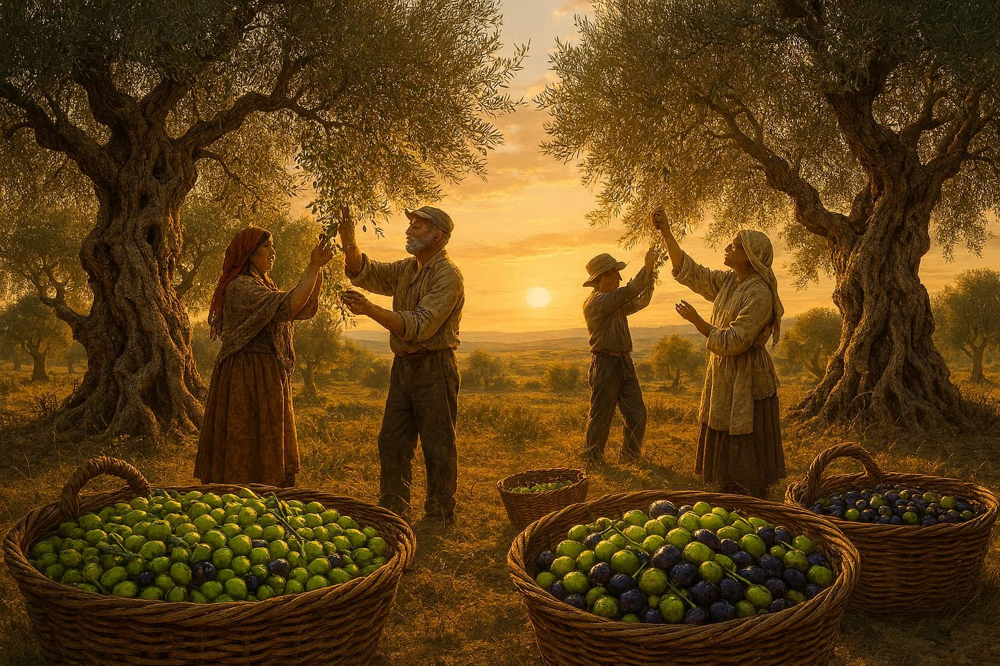
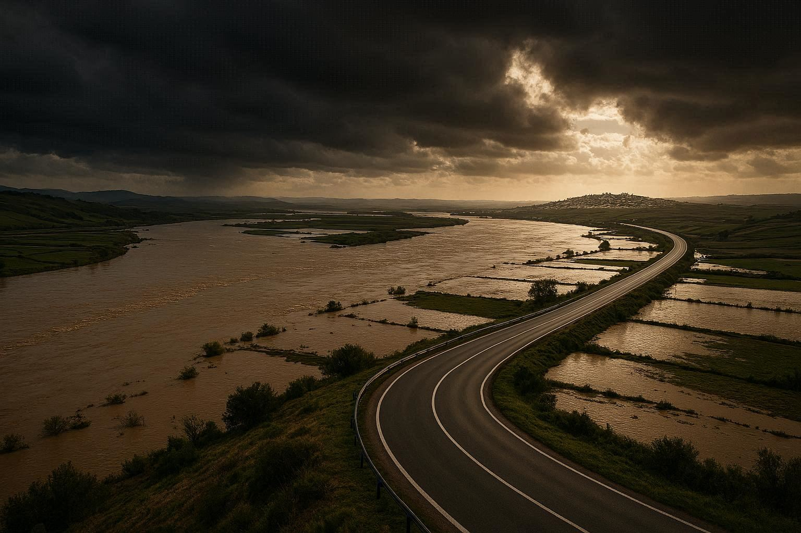
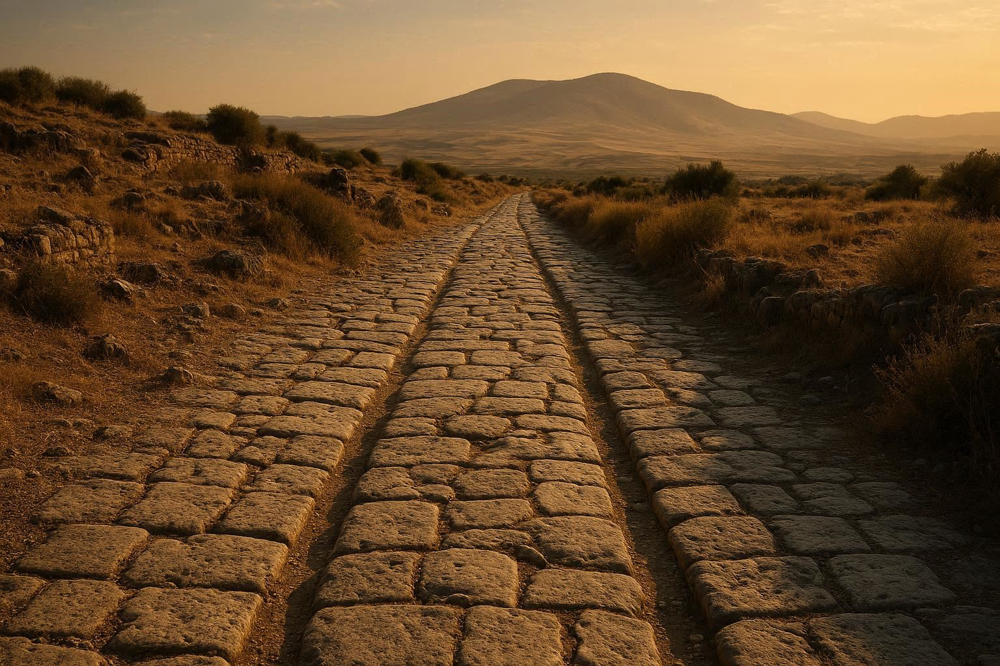
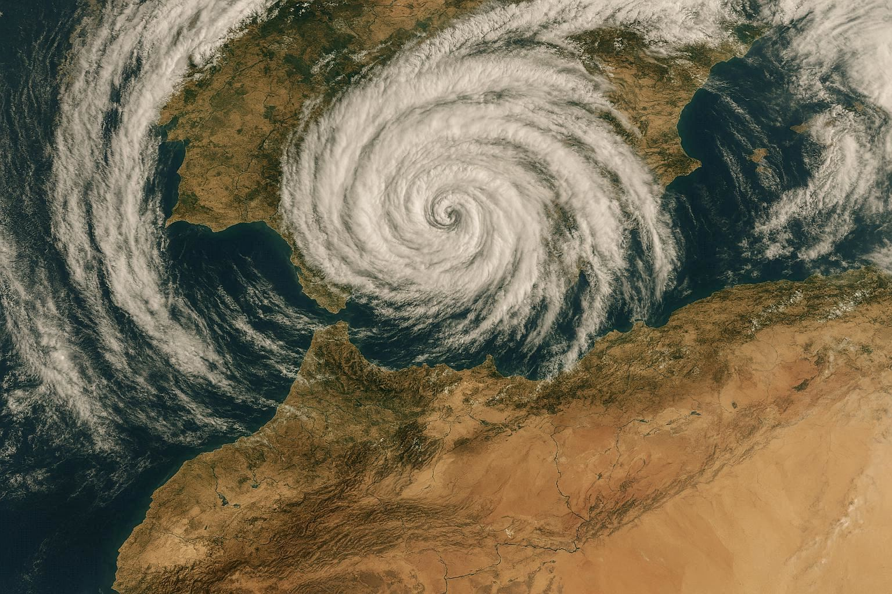
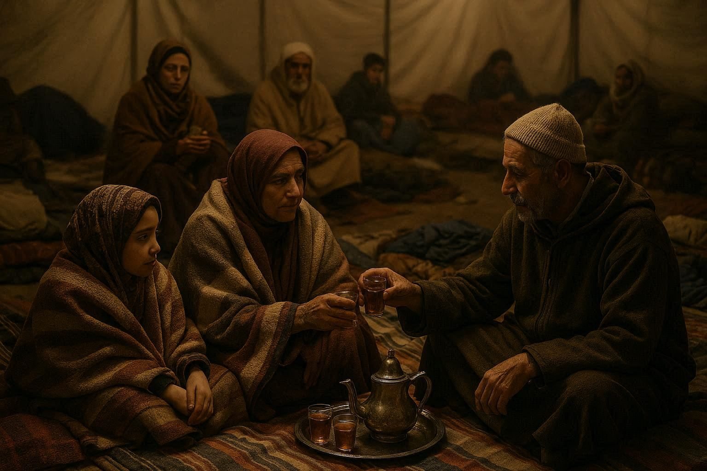
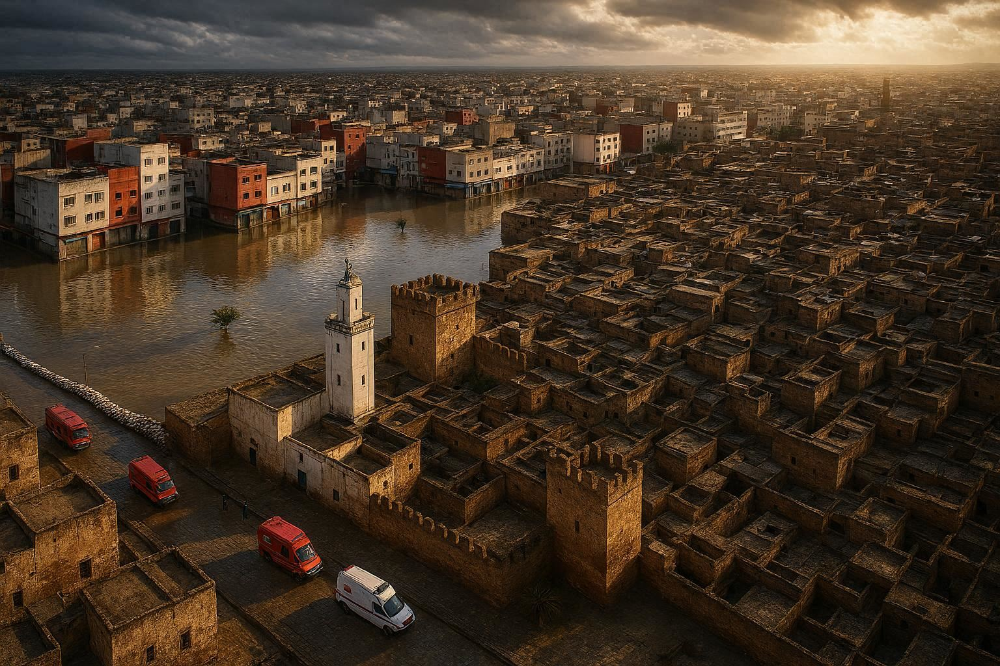
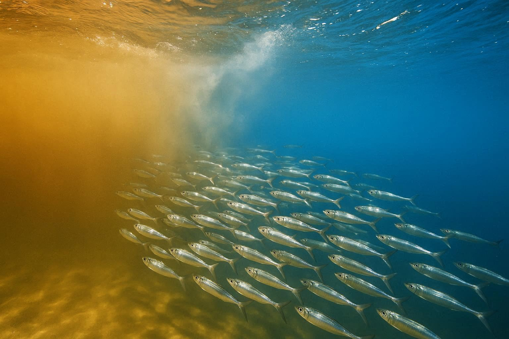

**Note on this writing:**  
*This is an unusual hybrid — born from the urgency of real evacuation. It attempts to capture simultaneously: (1) the immediate testimony of an ongoing disaster, (2) the historical reflection on memory layers it reveals, (3) the philosophical meditation on our relationship with elements. It does not claim to be exhaustive reporting, but an attempt to make sense of raw experience, in the tradition of philosophical travel journals. You will find as much mud as metaphor here.*

---

**Since November, I have been in Ksar el Kebir.**

I left Málaga and came down to northern Morocco, to my grandparents' village near the Loukkos valley, to take part in the olive harvest — to witness the pressing of extra virgin olive oil born from ancient trees, some of them centuries old, some perhaps older than memory itself.

**The rains began and did not stop** — a deluge depositing over 300mm in 72 hours, more than three times the monthly average for February. For nearly two months, the sky remained open, as if the season had forgotten how to close.

**Then, at midday on Tuesday, February 3rd, there was a knock at the door of my parents' house in Ksar el Kebir.** Officials stood there, calm but firm, requesting immediate evacuation. The water level was rising fast, triggering what would become the evacuation of 54,000 people — over 70% of this city of 78,000 souls.

**In that moment, the story was no longer historical, symbolic, or philosophical. The river had entered the present tense.**

## The Olive Harvest That Became a Flood Watch

I came for the olives. I stayed for the rising water.

For weeks, we worked between showers. The same olive trees I write about as "silent historians" — I was touching them, harvesting from them, watching their branches bend under fruit and rain. **Their wisdom felt tangible, not metaphorical.**

The pressing mill ran day and night. Fresh olive oil's scent mixed with wet earth. We celebrated abundance even as the skies warned of excess.

*The last harvest before the flood - abundance meets excess*

Then the rhythm changed. Conversations shifted from "How many kilos per tree?" to "How many centimeters has the river risen?" Extra virgin oil sat in clay pantries while outside, the water kept coming.

**This is the part they don't tell you about resilience:** sometimes it looks like continuing to harvest while watching the river swell. Sometimes it's pressing oil with one eye on the sky.

## The Knock at the Door

The evacuation order didn't come as surprise. It came as **ending.**

For two months, we had lived in the subjunctive: "If the river rises...", "When the dam reaches capacity..."

**The knock changed the grammar.** Indicative. Present tense. Active voice.

I looked at my parents — seventies, forty years in this house. My father glanced at his olive trees through the window. My mother packed photo albums before clothes.

**This is what 54,000 evacuations look like at human scale:** One family. One decision about what to carry. One last look around.

The officials were professional, even kind. But their presence made abstract numbers concrete. **Risk assessment became risk management.** Probability became necessity.

Around 1 p.m., I stepped outside and left Ksar el Kebir.

## The Road to Larache: Following Water's Logic

I drove toward **Larache**, where the Loukkos meets the Atlantic. The thirty-kilometer road follows the old Roman route. As I drove, I watched this giant river bind the two cities like an ancient artery.

The water had expanded beyond its usual boundaries — the Loukkos, normally 50 meters wide here, had swollen to over 500 meters, submerging 2,000 hectares of agricultural land. **It wasn't raging. It was simply occupying.** Reminding us who shapes the land.

*The Roman road rediscovered - water reclaims its ancient path*

The Romans built this road knowing what we've forgotten: **rivers determine geography, not the reverse.** They followed the Loukkos not from poetry, but practical necessity. Water flows downhill. Roads follow water. Cities grow where roads meet water.

**Today, the river reasserted this ancient truth.** The road felt less like asphalt than a concession — human order granted by natural consent.

I rented a furnished apartment in Larache. Now, I wait.

No one knows whether waters will recede in days or weeks. **Time here no longer answers to calendars.** It answers to saturation levels, evaporation rates, soil patience.

Larache sits on higher ground, safe for now. But uncertainty remains, suspended like humidity.

**This is disaster's strange mathematics:** Safe, but your city isn't. Body dry, but memory flooded.

## Ancestral Echoes on the Roman Road

**A police officer knocked and asked me to leave immediately.**

I have lived from bags, crossed borders, changed countries with the lightness of one who calls movement freedom. Leaving has always been my choice.

But stepping outside, an unfamiliar sensation rose — not fear, not urgency, but **attachment.** A quiet, biological pull toward place, space, patch of earth. As if somewhere in our bodies, in layers older than memory, we carry coordinates. As if land lives inside us too.

Driving north toward Larache — ancient **Lixus** — another feeling surfaced, deeper than my own story. A memory not mine alone.

*The road remembers - layers of departure and return*

I thought of my Morisco ancestors, forced from Andalusia centuries ago, crossing these same waters. What for them was exile, for me had been return. And now, temporarily, I was asked to leave again.

**History does not always repeat in events. Sometimes it returns as sensation.**

Driving, it felt less like evacuation than echo — soft continuity between past and present displacement. Not the same tragedy, not the same scale, but the same human experience: **separation from place that had become part of one's body.**

Movement is freedom.  
But sometimes, movement reveals where we are rooted.

## The Storm That Ignored Borders

I learned its name later — **Storm Leonardo**.

In early February 2026, while I pressed olives in the Loukkos valley, the same clouds gathered over my other home. My Málaga neighbor messaged: "The sky here looks like yours." Then: "Schools closed. Streets flooding." Then silence — battery dead, or networks failed.

I stood in my parents' courtyard, watching our sky, and realized: **the Strait had disappeared.**

Not physically — 14 kilometers of salt and current remained. But atmospherically, climatically, the border had dissolved. Málaga and Ksar el Kebir breathed same humidity, endured same cloud weight, watched same rain fall without horizon.

*The storm that ignored borders - one sky over two shores*

The storm moved by older logics — atmospheric, geographic, elemental.

For days, the Strait of Gibraltar did not divide — it **conducted.**

Sometimes history reunites territories through culture.  
Sometimes through memory.  
And sometimes, through simply being under one rain.

I was in both places. Body in Ksar el Kebir. Attention split — between olives I harvested and messages that stopped coming from the south.

## The Memory Trees I Had Just Touched

Two weeks ago, I pressed my hand against a 300-year-old olive trunk. Today, that tree stands with roots underwater.

**The biological memory I've theorized is now being written in real time.** Those annual rings — "silent historians" — record this moment as cellular fact, not metaphor.

When I return (and we speak of "when," not "if"), I will see those trees differently. Not just "centuries of history," but **this specific February 2026**, when water stayed and stayed.

These trees teach through presence. Today's lesson: **resilience is what happens between the knock at the door and the return home.**

## The Evacuation: From Abstract to Intimate

**I am one of the 54,000.** Not a statistic. A person who packed while officials waited.

In the shelter, I see the mother with family photos. The old man with his prayer rug. The child asking about pets. These aren't archetypes. They're my neighbors. People whose families have known mine for generations.

The "Moroccan solidarity" I've written about is no longer conceptual. It's the woman sharing blankets. The man giving his cot to an elder. The volunteer making tea through the night.

*Suspended breath - community in temporary space*

**But look at our empty streets on the news.** Ksar el Kebir, called "ghost town." From inside, it doesn't feel ghostly. It feels **suspended.** Like a breath held.

## The Bureaucracy of Water

I do not blame the officials who knocked. They were following protocol, executing orders framed by "Royal High Instructions" at 10:00 AM February 3rd, when dam levels reached 98% capacity. They were **doing their job.**

But I notice what the protocol cannot contain.

A city nearly a thousand years old floats in administrative in-between. Not destroyed enough for catastrophe status. Not untouched enough for peace. It exists in grey zone — between prevention and recognition.

The law asks: Is damage severe enough? Are losses sufficient? Is evidence conclusive?

The earth does not ask these questions.

**Centenary olive trees do not wait for decrees.** Their rings record water duration, not ministerial signatures. In a hundred years, someone will read in their wood: *"Soil was saturated beyond capacity."* Not: *"Emergency classification level three."*

Biological truth precedes bureaucratic truth.

Ksar el Kebir is not merely infrastructure to protect. It is the smell of cumin in the souk at 6 AM. It is the sound of the call to prayer bouncing off walls built before America existed. It is historical being — and historical beings don't file paperwork.

So an uncomfortable question remains: **Must a city be sufficiently broken before its suffering is acknowledged?**

There is a difference between managing crisis and honoring trauma.

Logistics save bodies. Recognition preserves dignity.

When waters withdraw, when mud is cleaned, an invisible choice remains: Will this be remembered as **"The 2026 Loukkos Flood Response"** or **"The year Ksar el Kebir held its breath"?**

The language we choose for suffering determines the respect we grant what suffered.

And perhaps the forgotten wisdom: facing certain trials, the first response is not to categorize, but to be present. Not to label, but to witness.

*The city's duality - ancient history meets modern administrative reality*

## The Messenger Sardines Will Know First

In Larache, where the Loukkos meets the Atlantic, sardines wait. They will sense fresh water mixing with salt long before official reports are filed.

These small fish, **"biological algorithms"** I've theorized, will soon migrate north with this message in their bodies: **"The earth has drunk too much; it returns to oceans what it cannot keep."**

When they reach Andalusian shores, when fishermen from Huelva or Cádix — or old men who have watched this river for sixty years — catch them, they won't know they hold postal messages. **"The Loukkos has overflowed,"** whisper sardines in their silent language. **"Ksar el Kebir has trembled."**

*The biological algorithms carry their messages across the strait*

This is **strait consciousness:** everything connects. A Morocco flood modifies coastal water composition, influences fish migrations, affects Spanish fisheries. **Ksar el Kebir's pain travels, transforms, becomes nourishment elsewhere.**

## The Philosophy of Water From Within It

In my Sufi tradition, water is the most humble and most powerful element. It flows downward, takes lowest paths, doesn't fight the slope. Yet it shapes mountains, carves canyons, wears down stone.

**The flood is a lesson in humility.** It reminds us that our plans, projects, ambitions are written in sand at water's edge. One day, tide rises, and everything is taken.

But look at what it cannot take:

1. **The memory of olive trees** — living archives keeping trace
2. **The message of sardines** — couriers between worlds  
3. **Human solidarity** — neighbors helping, strangers becoming family
4. **Hope** — that almost illogical conviction that we will return

Water can drown a house, but not a home. It can flood a street, but not a neighborhood. It can empty a city, but not a community.

## What We Will Do When the Water Recedes

In a few days, the waters will recede. Mud will remain. Everywhere. In houses, shops, streets. The mud will dry, crack, become dust.

**The real work will begin then.** Not reconstruction — we know how. But reconsideration. Reflection. Conversation with the river.

Will we rebuild exactly as before, same place, same certainties? Or will we listen to what the oued whispered?

Our ancestors built with nature, not against it. They knew cycles, respected limits. We have forgotten this language. Perhaps this flood is a wake-up call. **Not divine punishment, but memory returning.**

I am with 54,000 people learning resilience as craft in real time. It is practiced in sharing blankets, worked in waiting for news, learned in camp mud, in communal tea taste, in stories told to pass hours.

**Morocco has long history with this craftsmanship.** We know rebuilding after earthquake, greening after drought. This knowledge is in our bones, even when we forget.

## A Secular Prayer From Larache

I do not pray often in conventional ways. But tonight, from this rented apartment, I make a secular prayer:

*May the water recede gently.*  
*May the mud dry under sun.*  
*May each return home be return to self.*  
*May each reconstruction be reconciliation.*  
*May olive tree memory be listened to.*  
*May sardine message be heard.*  

And above all: *May this memory of water not evaporate too quickly.*

## **Still Here, Still Waiting**

It is now Thursday, February 5th. I am still in Larache.

Yesterday, I walked to the river mouth. The Loukkos meets the Atlantic with less force now, but the water remains high, brown, carrying soil from upstream fields.

I met one of those old fishermen who has watched this river for sixty years. He has seen the Loukkos flood seven times in his life. He told me: *"The water always returns what it borrowed. But it changes the shape of the shore. We never get back exactly what we had. We get back something new."*

I asked him if he was worried about his nets, his catch. He laughed. *"The sardines carry their knowledge in their bodies. We carry ours in waiting. When they come back, we'll know it's time."*

This morning, my father called from another shelter. He had returned briefly to our street — water has receded from the house, but mud reaches halfway up the walls. My mother asked about her photo albums. I told her they were safe. **What she really asked was: Will the story continue?**

I don't know when I will return to Ksar el Kebir. The officials say "soon." The river says "when I am ready." The olive trees say nothing — they simply record.

**I came here thinking I was harvesting olives. I leave knowing I was harvesting proof that one can be rooted and in motion — that the knock at the door doesn't erase the years of tending, that evacuation is not exile when you carry the coordinates of return.**

The knock at the door was an ending. But also a beginning.

When I return to clean the mud from my parents' house, I will not just be cleaning walls. **I will be reading the first pages of a new chapter** — one that could tell how a city learned to dance with its river, rather than turning its back on it.

Until then, I wait. With the sardines. With the memory of water. With the 54,000.

**The olive trees have known this rhythm for centuries. We are relearning it now, together.**

---

**To my brothers and sisters of Ksar el Kebir,**

We are living this together. I have no technical solutions from a distance. I am here, with you, packing and waiting and hoping.

I have only this conviction: we are not passive victims of natural catastrophe. We are active participants in an ancient conversation between humans and elements.

This conversation is painful now. But it is necessary.

When we return to our homes, when we clean the mud, remember: we are not only cleaning walls. We are preparing pages of a new chapter.

**A chapter that tells how a city learned to dance with its river.**

---

*P.S.* — This article was written in real-time from Larache, February 4-5, 2026. A companion piece, "Returning to the Mud," will document the physical work of return — because resilience is not just philosophy, it is also buckets and shovels and neighbors helping each other carry sofas. [Subscribe to Rooted Nomadism](/newsletter/) for meditations on resilience, not just news.

*Dedicated to the centenary olive trees of the Loukkos valley I harvested weeks ago, the messenger sardines of Larache, and the 54,000 souls in movement, including my own family. May our collective memory be as deep as roots, as mobile as fish, as enduring as water itself.*

---

## How to Support Ksar el Kebir

**Immediate Relief:**
- [Moroccan Red Crescent](https://www.croissant-rouge.ma) — On-ground emergency response

**Follow the Story:**
This article will update as waters recede. [Subscribe](/newsletter/) for meditations on resilience, not just news.

*Are you in Ksar el Kebir? Evacuated? Witnessing this?*  
[Share your story →](/contact/) Your testimony becomes part of the olive tree memory.