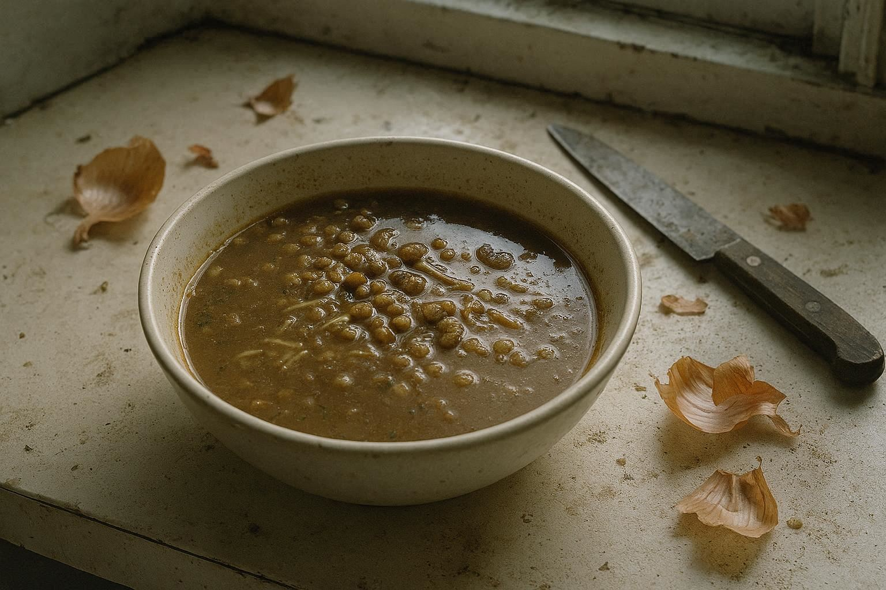

**Last Tuesday at 3:17 PM, I found myself staring at a perfect, color-coded Notion dashboard while tears of pure frustration blurred the beautiful geometry. Every tile was placed. Every project tagged. Every deadline tracked in a serene shade of pastel green.**

**And absolutely nothing was moving.**

This wasn't the romantic chaos of a Mediterranean market. This wasn't a poetic "nomadic interlude." This was that very American feeling—one I know my friends in Brooklyn lofts and Austin co-working spaces know intimately.

It is the feeling of having read *Atomic Habits*, mastered *Getting Things Done*, and optimized your Deep Work blocks to the minute... and still feeling like you are drowning in slow motion.

For years, I have built a reputation as the architect of **Rooted Nomadism**. I sell the promise that if you just structure your life like a Moroccan mosaic—with intention, precision, and geometric harmony—you can weather any storm. I built a cathedral of productivity to house my life.

Last week, the cathedral collapsed. And I'm still sitting in the rubble.

## The Perfect Storm

It didn't happen with a bang. It happened with the silent accumulation of three notifications that shattered my carefully curated peace.

**First, the money.** A US-based client I had nurtured for six months—a contract worth $12,000 that was supposed to fund my entire Q3 "Olive Grove" asset strategy—ghosted. No explanation. Just a calendar invite deleted and a Slack account deactivated. In the American gig economy, we call this "business." In my stomach, it felt like a physical blow.

**Second, the state.** My Spanish residency paperwork hit a Kafkaesque wall. A missing stamp from 2019. A threat of deportation wrapped in polite bureaucratic legalese. My **Algorithmic Sardine** philosophy says we should move through borders with purpose. The Spanish government said I wasn't moving anywhere.

**Third, the blood.** My father called from Morocco. His voice, usually as sturdy as the Atlas Mountains, sounded thin. He didn't give me a diagnosis—he gave me a tone. The kind of tone that makes "quarterly goals" feel obscene.

Any one of these I could have handled. All three? At 3:17 PM on a Tuesday?

My response was pathetic. I didn't go for a walk. I didn't meditate. I opened my **Zellige Blueprint** dashboard.

I literally tried to drag "Existential Dread" into an Asana task.

I clicked on "Resolve Visa Issue" and tried to tag it with a priority level. I looked at "Client Revenue Gap" and tried to assign a due date. The software mocked me. It asked if I wanted to move my father's mortality into the "Incubation Phase."

I had built a system for a life that moved in elegant cycles. But life wasn't moving in a cycle. It was hitting me with a hammer.

## The Raw Clay

I wish I could tell you that I remembered my training. That I engaged the **Baker's Code**, initiated a "Sacred Silence" phase, and breathed through the panic.

I didn't.

I closed the laptop. I walked into my kitchen. And I unraveled.

For 48 hours, I ceased to be a "Rooted Nomad." I was just a scared man in a rented apartment.

*The failed harira – mediocrity as anesthesia*

I cooked *Harira*—the traditional Moroccan soup. But this wasn't the mindful, sensory cooking I write about in my guides. I chopped onions with a dull knife until my eyes stung. I threw lentils into the pot with aggression. I didn't taste it. I ate the same soup for three days straight. Repetition as anesthesia.

And it was bad. The lentils were either tooth-cracking hard or turned to mush. Twice, I forgot the saffron—the very ingredient I wrote a 2,000-word essay about preserving. It tasted like hot, brown water. I ate it anyway.

I turned off my phone. Not as a "Digital Detox" strategy to improve my focus. I turned it off because every vibration felt like a threat.

At 4:00 AM my time, unable to sleep, I called a friend in San Francisco. It was 7:00 PM for him. He answered, expecting our usual mastermind banter about SEO strategies or crypto trends.

"I'm not okay," I said.

There was no preamble. No "cultural bridge." No philosophical framing. Just the raw, jagged edge of failure.

"I know," he said. "Me neither."

And we sat there, 6,000 miles apart, two men who had optimized every inch of our lives, sitting in the dark, admitting that we were tired.

## The Lie of Architecture

We love our systems, don't we? We love Tim Ferriss and Cal Newport because they promise us that chaos is an engineering problem. If we just have the right Trello board, the right morning routine, the right *framework*, we can process grief like we process email.

I realized, staring at the cold soup in my bowl, that my **Zellige Blueprint** assumes a stable wall to hang the mosaic on. It assumes a substrate of normalcy.

But what happens when the wall crumbles?

I let deadlines pass. I didn't email to apologize. I didn't "manage expectations." I simply failed to show up. I broke the cardinal rule of American professionalism: consistency above all else.

And the sky didn't fall. But my ego did.

I realized that for all my talk of **"The Olive Grove Economy"**—of building resilience like a tree—I was acting like a factory manager. I wanted output. I wanted to process the trauma of my father's voice and the fear of losing my visa into "actionable insights" by Friday.

But trees don't process storms into insights. They just endure. Sometimes they lose branches. Sometimes they don't bear fruit for a season. They don't have a dashboard for that. They just stand there, in the mud, waiting for the sun to come back.

## The Unresolved Ending

I am writing this one week later.

I want to give you a takeaway. My writer's instinct is screaming at me to wrap this up with a new framework: *"The 3-Step Protocol for Crisis Management."* I want to tell you how I fixed the visa, replaced the client, and healed my father.

But I can't.

*The red alerts remain*

My Notion dashboard still shows red alerts. The client is gone, and that $12,000 hole is real. I am eating into my savings. The Spanish bureaucracy is still silent. My father is still frail.

The only difference is that I'm writing this from my messy kitchen table, not my optimized standing desk. There are crumbs on the floor. I haven't tracked my habits in six days.

The olive tree outside my window in Málaga is swaying in the wind. It doesn't have a productivity system. It doesn't have a 5-year plan. It just has roots, and it has the present moment.

I don't know if the **Zellige Blueprint** is resilient or fragile. I don't know if I'm a fraud for teaching systems that couldn't save me from a bad Tuesday.

All I know is this: sometimes the mosaic cracks. Sometimes you are left holding nothing but sharp, broken tiles in your bleeding hands. And maybe—just maybe—that is where the real work begins. Not in the perfect pattern, but in the mess on the floor.

---

**If you are reading this, and your system has failed you recently—if you are staring at a to-do list that makes you want to scream—I don't have a solution for you today.**

**I just have this confession.**

**You are not a machine. You are not an algorithm. You are clay. And sometimes, the clay needs to break before it can be reshaped.**

**Leave a comment below with just two words: "mine too."**

**Or email me directly. Not for advice—I have none to give right now. Just to say it out loud.**

**Sometimes the most radical productivity hack is admitting we are human.**

---

**P.S.** The broken tiles of my zellige are still on the floor. I'm not picking them up yet. I'm just learning to see the pattern they make where they fell. It's not beautiful. But it's true.
